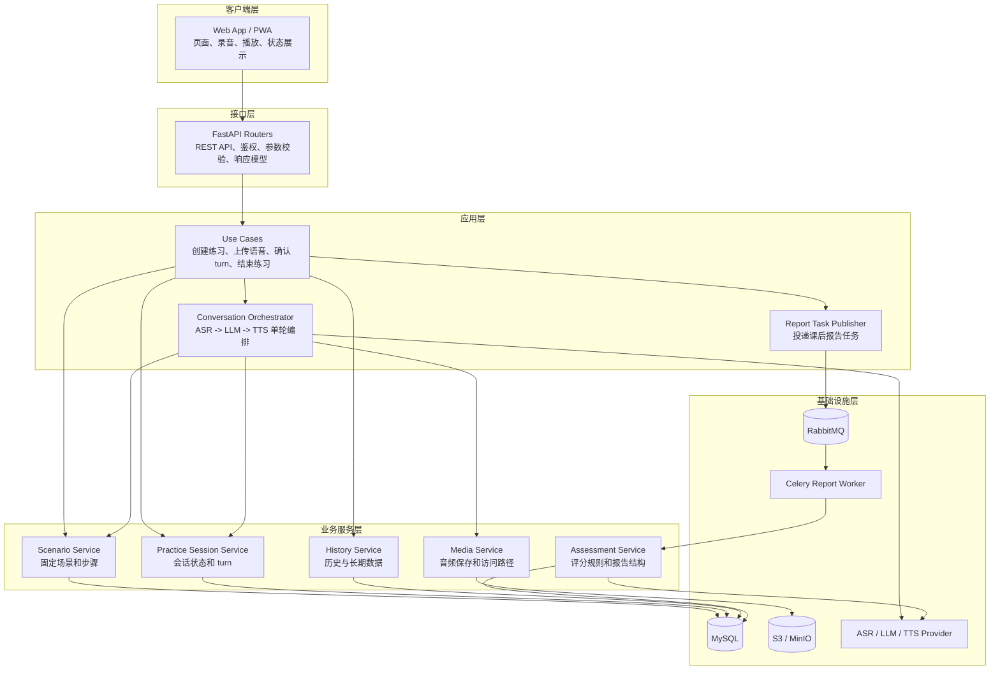
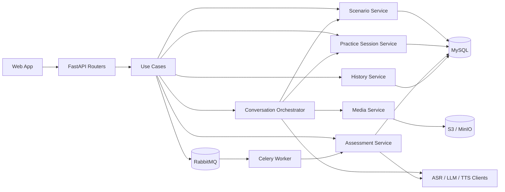
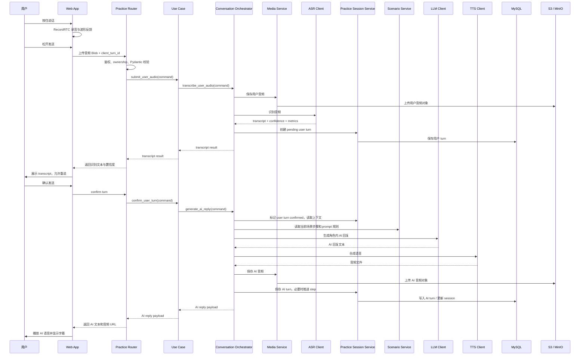
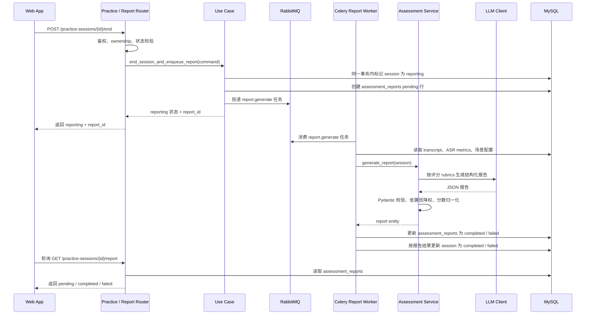
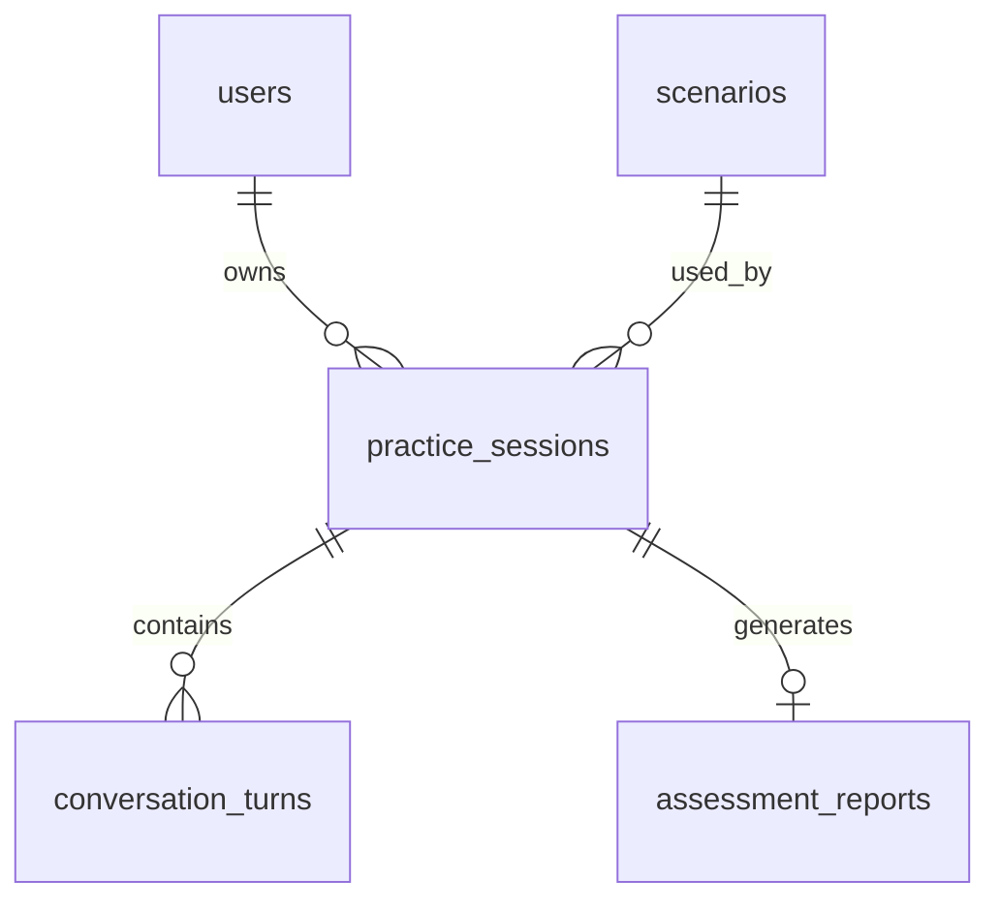
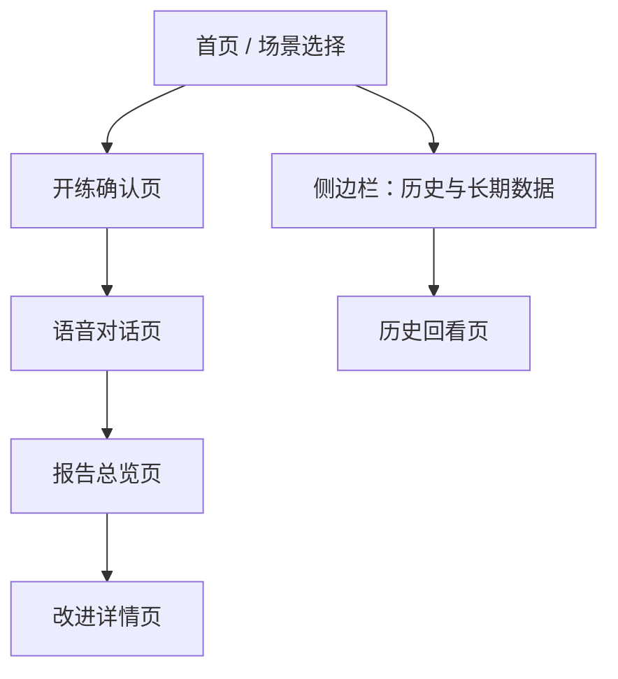
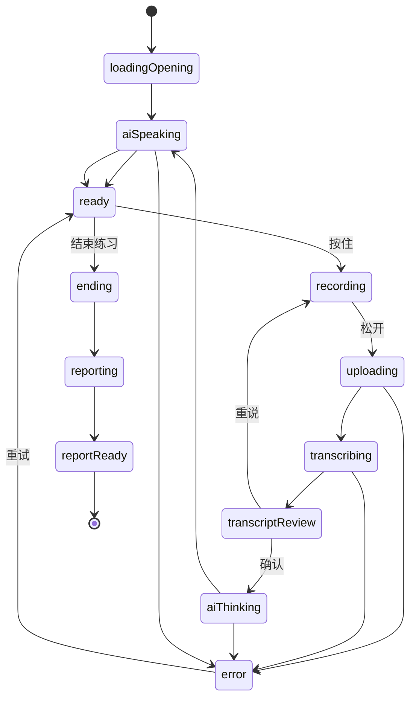

# AI 英语口语陪练 MVP 技术方案

编写日期：2026-06-07  
版本：V0.1  
输入文档：[AI英语口语陪练MVP方案.md](AI英语口语陪练MVP方案.md)  
目标：将产品 MVP 方案转化为可研发落地的技术选型、系统架构、数据库、UI 状态、接口与部署方案。

## 1. 技术目标与边界

### 1.1 MVP 技术目标

本项目首版要优先证明“固定场景角色扮演口语训练闭环”可以稳定跑通，而不是一次性建设完整学习平台。

核心技术目标：

- 用户可以从 3 个固定场景中选择一个场景开始练习。
- 用户通过“按住说话、松开发送”完成语音输入。
- 系统完成 ASR 识别、AI 角色回复、TTS 播放、Transcript 保存。
- 对话过程中不打断纠错，课后生成结构化评分报告。
- 历史记录、长期数据和单次报告可以回看。
- 语音链路 P95 目标拆成两段验收：用户松开发送到 transcript 返回不超过 1.5 秒；用户确认 transcript 到 AI 音频可播放不超过 4 秒。用户阅读和确认 transcript 的时间不计入技术链路延迟。

### 1.2 首版假设

- 首版以 Web / PWA 为主，优先适配移动端浏览器，同时兼容桌面浏览器。
- 首版允许匿名用户使用，以设备级匿名身份保存历史记录。
- 首版只做 3 个固定场景：英文面试、餐厅点餐、英文会议。
- 首版只做按住说话，不做自动连续收音。
- 首版优先接入成熟云端 ASR / TTS / LLM 服务，不自研语音识别、语音合成和大模型。
- 首版默认把“发音评测”收敛为可懂度 / 清晰度评分，由 ASR 置信度、词级置信度、语速、停顿和 LLM rubric 共同形成；没有专用发音评测接口时，不生成音素、重音、连读等细粒度发音结论。如果接入的语音服务提供专用发音评测接口，则通过适配器补充词级发音建议。

### 1.3 暂不做范围

- 不做完整账号体系、付费体系、班级体系。
- 不做用户自定义场景。
- 不做真人老师介入。
- 不做自动收音和实时打断纠错。
- 不做复杂 CEFR 等级考试式测评。
- 不做多端原生 App，Web 能跑通后再评估 App 化。

## 2. MVP 技术选型

### 2.1 最终采用的 MVP 技术栈

本方案后续设计统一以轻量 MVP 技术栈为准，目标是优先做出可演示、可验收的 demo，而不是提前搭建完整生产级工程体系。

| 层级 | MVP 采用 | 选择理由 | 后续可升级 |
|---|---|---|---|
| 前端框架 | Next.js | 页面、API 调试、静态资源和部署体验更一体化，工程师熟悉度高 | React + Vite |
| UI 样式 | shadcn/ui | 基于 Tailwind 和 Radix，出页面快，组件观感适合 demo | Tailwind CSS 手写 |
| 前端状态 | Redux Toolkit | 团队常见、状态流清楚，适合管理练习页复杂状态 | Zustand |
| 音频采集 | RecordRTC | 封装浏览器录音兼容性，减少直接处理 MediaRecorder 细节 | Web Audio API + MediaRecorder |
| 通信方式 | REST + 可选 SSE | REST 是主结果契约，处理上传、确认、AI 回复结果和普通查询；SSE 只推送 AI / 报告进度，断开后用轮询恢复；不引入 WebSocket | WebSocket |
| 后端框架 | FastAPI + Python | 轻量、上手快、Pydantic 校验天然适配 API；接 AI provider 和音频处理方便 | Spring Boot / NestJS |
| ORM | SQLAlchemy / SQLModel | 坚持 FastAPI 后端时，Python 生态下 SQLAlchemy / SQLModel 是更常用、可维护的落地选择 | Drizzle ORM 仅适用于 Node/TypeScript 后端 |
| 主数据库 | MySQL | 团队熟悉、部署常见，demo 数据结构不复杂 | PostgreSQL |
| 后台任务 / 队列 | RabbitMQ + Celery | RabbitMQ 是 MVP 备选列选型；Python 侧用 Celery 消费报告任务最常见 | FastAPI BackgroundTasks |
| 音频对象存储 | S3 / MinIO | MinIO 本地可跑，接口兼容 S3，适合 demo 和后续云存储迁移 | 七牛云 Kodo / 其他 S3 兼容存储 |
| AI 能力 | 单 provider 直连 + 轻量 client | MVP 先接一个可用 ASR / LLM / TTS provider，不做复杂多供应商切换 | Provider Adapter 抽象层 |
| 校验与 Schema | Pydantic | FastAPI 原生支持，API 入参、响应和报告 JSON 都能复用 | 独立 JSON Schema 包 |
| 日志 | Python logging | 足够支撑 demo 排查 | Sentry / OpenTelemetry |
| 部署 | Docker Compose | MySQL、RabbitMQ、MinIO 都可本地一键拉起，便于团队统一环境 | 容器服务 / K8s |

### 2.2 选型原则

- 后续设计以原 2.1 表格的 MVP 备选列为主：Next.js、shadcn/ui、Redux Toolkit、RecordRTC、REST + 可选 SSE、FastAPI、MySQL、RabbitMQ、S3 / MinIO。
- FastAPI 与 Drizzle ORM 存在生态错位：本方案坚持 FastAPI，因此 ORM 不采用 Drizzle，改用 SQLAlchemy / SQLModel。
- 优先保证 demo 主链路稳定：选场景、开练、按住说话、AI 回复、结束、看报告。
- RabbitMQ、MySQL、MinIO 通过 Docker Compose 本地启动，不做集群和高可用。
- AI 能力先做单 provider 轻量 client，不一开始做复杂 provider registry；但保留文件边界，避免业务代码直接散落第三方 SDK 调用。

## 3. 系统架构

### 3.1 架构设计结论

MVP 阶段采用“FastAPI API + MySQL + RabbitMQ/Celery + S3/MinIO”的 demo 架构。

这套方案的目标很明确：

- 用最少基础设施跑通图 2 / 产品方案要求的必要功能。
- 使用 MVP 备选列中的常用轻量技术，避免引入 WebSocket、微服务、K8s、高可用集群等偏生产化复杂度。
- 保留清晰的代码边界：Router 负责接口入口，Use Case / Orchestrator 负责流程，Service 负责单块业务规则，Client 负责外部 AI / 存储调用。
- 后续如果 demo 通过、需要产品化，可以在不推翻业务逻辑的前提下替换数据库、存储和后台任务实现。

首版运行形态：

```text
Web / PWA
  -> FastAPI API 服务
       -> Routers
       -> Use Cases / Conversation Orchestrator
       -> Domain Services
       -> Provider Clients
       -> MySQL / RabbitMQ / S3-MinIO
```

这里仍然是轻量部署：FastAPI 负责 API 和单轮语音链路，Celery worker 只负责课后报告任务，RabbitMQ 只作为报告任务队列，MinIO 用 S3 协议保存音频。前端通过 REST 完成上传、确认、AI 回复结果和查询；SSE 只作为可选进度通道，用于展示 `ai.generating`、`ai.text.done`、`ai.audio.ready`、`report.ready` 等状态，断开后降级轮询，不默认引入 WebSocket。

### 3.2 整体分层关系



分层说明：

| 层级 | 作用 | MVP 中的具体模块 | 设计边界 |
|---|---|---|---|
| 客户端层 | 承载用户交互和本地音频能力 | Web App、录音、播放、波形、页面状态 | 不做评分和 AI prompt 决策 |
| 接口层 | 把 HTTP 请求转换成内部命令 | FastAPI Router、Pydantic request / response model | 只做鉴权、校验、ownership 检查、响应转换 |
| 应用层 | 组织一次完整用户动作 | Use Case、Conversation Orchestrator、Report Task Publisher | 负责跨模块调用顺序和降级策略 |
| 业务服务层 | 维护单个业务对象的规则 | 场景、练习会话、媒体、评分、历史 | 不直接处理 HTTP，也不直接依赖前端展示 |
| 基础设施层 | 保存数据、承载任务和调用外部能力 | MySQL、RabbitMQ、S3 / MinIO、AI provider client | 不承载业务流程 |

依赖方向保持简单单向：Router 调 Use Case，Use Case 调业务服务、队列和 provider client，业务服务读写 MySQL 或对象存储。业务服务不反向调用 Router，provider client 不写业务判断。

### 3.3 Router、Use Case、Service 的关系

MVP 不采用复杂 Clean Architecture，但需要避免把所有逻辑堆到 Router 或一个大 Service 里。

| 对比项 | Router | Use Case / Orchestrator | Service |
|---|---|---|---|
| 主要职责 | 接收 HTTP 请求，做鉴权、参数校验、响应模型转换 | 完成一次用户动作的流程编排 | 处理单一业务模块内部规则 |
| 示例 | `POST /practice-sessions/{id}/user-turns` | `submit_user_audio()` | `PracticeSessionService.create_user_turn()` |
| 是否直接调 ASR / LLM / TTS | 不直接调用 | 可以通过 provider client 调用 | 通常不直接调用，除非是评分服务内部需要 LLM |
| 是否感知 HTTP | 是 | 否，只接收 command / dto | 否 |
| 测试重点 | API 入参和权限 | 主流程、异常和降级 | 单模块业务规则 |

以“确认 transcript 后生成 AI 回复”为例：

```text
practice_turns_router.confirm_turn()
  1. 校验用户身份和 session ownership
  2. 校验 session_id、turn_id
  3. 调用 confirm_user_turn_use_case(command)
  4. 同步等待 AI 回复结果，返回 AI 回复文本、音频 URL 和当前步骤

confirm_user_turn_use_case()
  1. 将用户 turn 标记为 confirmed
  2. 读取场景步骤和最近上下文
  3. 调用 LLM 生成角色内回复
  4. 调用 TTS 合成语音
  5. 保存 AI 音频和 AI turn
  6. 返回前端需要展示的数据
```

这样设计的好处是：代码结构比“Router 直接调一堆函数”清楚；同时只把“课后报告”这一类耗时任务放进 RabbitMQ，不把所有流程都事件化，符合 demo 阶段。对话主链路的主结果以 REST 响应为准，SSE 只提供进度体验和恢复辅助，避免前后端维护两套结果来源。

### 3.4 模块关系总览



关键约束：

- Router 之间不互相调用，跨流程协作进入 Use Case。
- `Conversation Orchestrator` 是实时对话主流程入口，ASR、LLM、TTS 的调用顺序由它控制。
- `AssessmentService` 只负责课后评分和报告，不参与对话中的角色扮演。
- `HistoryService` 只读取已完成或可回看的数据，不反向修改对话链路。
- Provider client 只负责调用第三方服务和错误归一化，不负责判断业务流程。

### 3.5 核心模块职责

| 模块 | 所在层级 | 职责 | 不负责 | 主要依赖 |
|---|---|---|---|---|
| Web App | 客户端层 | 首页、开练确认、按住说话、录音波形、字幕、报告和历史展示 | AI 决策、评分规则、provider 调用 | REST API、SSE / 轮询 |
| Auth | 接口 / 业务服务 | 匿名用户创建、轻量 token、请求用户识别 | 正式账号体系、手机号、社交登录 | MySQL |
| Scenario | 业务服务层 | 维护 3 个固定场景、步骤、角色、开场白、prompt 片段 | 用户自定义场景、推荐算法 | MySQL seed |
| Practice Session | 业务服务层 | 创建练习、维护状态、保存 turn、确认和丢弃 transcript、结束练习 | 直接生成报告详情 | MySQL |
| Conversation Orchestrator | 应用层 | 编排用户语音上传、ASR、transcript 确认、上下文拼接、AI 回复、TTS | 长期统计、报告详情生成 | Scenario、Practice、Media、Provider |
| Media | 业务服务 / 基础设施 | 保存音频文件、生成对象 key / 访问 URL、记录音频元数据 | 发音评分、语音识别 | S3 / MinIO |
| Assessment | 业务服务层 | 分数公式、低置信降权、报告 JSON 校验、改进建议结构化 | 实时对话追问 | MySQL、LLM client |
| History | 业务服务层 | 历史列表、单次 transcript 回看、累计练习次数、开口时长、平均分和趋势 | 修改练习流程 | MySQL |
| Provider Clients | 基础设施层 | 调用 ASR / LLM / TTS，处理超时和错误 | 业务流程决策 | 第三方 AI 服务 |
| Report Worker | 应用层 | 消费报告任务、读取 transcript、调用 Assessment、写入报告、失败标记 | 实时返回 AI 回复 | RabbitMQ、Celery |

### 3.6 API 入口到内部模块的映射

| 用户动作 / 接口 | Router | 应用层入口 | 关键输出 |
|---|---|---|---|
| 首次进入产品 | `POST /auth/anonymous` | `create_anonymous_user()` | 匿名 token、`user_id` |
| 查看 3 个场景 | `GET /scenarios` | `list_scenarios()` | 场景列表 |
| 查看开练确认页 | `GET /scenarios/{slug}` | `get_scenario_detail()` | 场景说明、预计时间、任务步骤 |
| 点击开始练习 | `POST /practice-sessions` | `create_practice_session()` | `session_id`、AI 开场白文本 / 音频 |
| 松开发送语音 | `POST /practice-sessions/{id}/user-turns` | `submit_user_audio()` | 用户 turn、transcript、置信度 |
| 确认 transcript | `POST /practice-sessions/{id}/turns/{turn_id}/confirm` | `confirm_user_turn()` | 同步返回 AI 回复、AI 音频、步骤变化；SSE 只推送进度 |
| 重说 | `POST /practice-sessions/{id}/turns/{turn_id}/discard` | `discard_user_turn()` | turn 标记为 discarded |
| 结束练习 | `POST /practice-sessions/{id}/end` | `end_session_and_enqueue_report()` | session 进入 reporting，创建 pending report，报告任务进入 RabbitMQ |
| 查看报告 | `GET /practice-sessions/{id}/report` | `get_report()` | pending / completed / failed 报告状态和内容 |
| 查看历史和长期数据 | `GET /practice-sessions`、`GET /me/stats` | `list_history()`、`get_my_stats()` | 历史列表、累计数据 |

### 3.7 MVP 必要功能覆盖关系

| 图 2 / 产品方案必要功能 | 架构承载模块 | 说明 |
|---|---|---|
| 场景选择 | Web App、Scenario Router、Scenario Service | 3 个固定场景由 seed 初始化，首页只读取和展示 |
| 开练前准备 | Web App、Scenario Service | 开练确认页展示场景名、一句话说明、预计时间和任务流程 |
| 实时语音对话 | Web App、Practice Router、Conversation Orchestrator | 按住说话、状态展示、AI 文本和音频返回都在这条链路完成 |
| 发音评测 | ASR client、Assessment Service、Report Worker | 每轮保存 ASR 置信度和 speech metrics，课后汇总为发音 / 可懂度分和建议；无专用发音评测时不输出音素或重音级结论 |
| 语法 / 表达纠错 | LLM client、Assessment Service、Report Worker | 对话中不打断，结束后基于 transcript 生成结构化反馈 |
| 课后总结 | Practice Router、RabbitMQ、Report Worker、Assessment Service | 结束练习后后台生成总评分、水平描述、一句话总结和改进详情 |
| 对话自然度 | Scenario Service、Conversation Orchestrator、LLM client | 场景角色、当前步骤和上下文一起进入 prompt，AI 只做角色内追问 |
| 语音端到端流畅性 | Conversation Orchestrator、Provider Clients、REST + SSE | 分段记录 ASR / LLM / TTS 耗时，前端展示等待状态 |
| 纠错精准度与时机 | Practice Session Service、Assessment Service | 用户先确认 transcript，低置信 turn 降权或不评分，纠错集中在课后 |
| 口语能力量化反馈 | Assessment Service、History Service | 总分、四项细分分、历史平均分和趋势由报告与历史模块提供 |
| 历史记录与长期数据 | History Router、History Service、MySQL | 单次练习 transcript 和报告可回看，长期数据由已完成 session 动态聚合 |

### 3.8 MVP 阶段保留与暂不引入的架构能力

MVP 保留：

- FastAPI API：一个 API 服务承载接口和实时语音主链路，便于本地调试和 demo 部署。
- 轻量应用层：只保留关键 Use Case 和 `ConversationOrchestrator`，避免 Router 变胖。
- RabbitMQ + Celery：只处理课后报告生成，不把实时对话链路放进队列。
- MySQL：承载结构化会话、turn、报告和历史数据。
- S3 / MinIO：保存用户录音和 AI 合成音频。
- 轻量 provider client：ASR / LLM / TTS 各自一个 client 文件，方便 mock 或替换真实 provider。
- 清晰的状态机：`in_progress`、`reporting`、`completed`、`failed` 等状态支撑前端恢复和异常提示。

MVP 暂不引入：

- 微服务拆分和服务注册。
- Redis、BullMQ。
- PostgreSQL 和复杂迁移体系。
- WebSocket 实时通道。
- CQRS / Event Sourcing。
- 独立配置后台。
- 独立媒体资产表和复杂素材生命周期。
- 实时逐词打分和对话中显性纠错。

这个取舍能保证首版既实现必要功能，又不因为架构过重拖慢交付。

### 3.9 单轮语音链路



### 3.10 课后报告链路



## 4. 推荐项目结构

```text
qiniu-AI_Conversation_Coach_for_Spoken_English/
  apps/
    web/
      src/
        app/
          page.tsx
          practice/
          reports/
        components/
          ui/
        features/
          scenarios/
          practice/
          report/
          history/
        store/
        lib/
          audio/
          api/
          sse/
        styles/
    api/
      src/
        main.py
        config.py
        api/
          deps.py
          routes/
            auth.py
            scenarios.py
            practice_sessions.py
            practice_turns.py
            reports.py
            history.py
        application/
          use_cases/
            create_practice_session.py
            submit_user_audio.py
            confirm_user_turn.py
            end_practice_session.py
            generate_report.py
          conversation_orchestrator.py
        domain/
          services/
            auth_service.py
            scenario_service.py
            practice_session_service.py
            media_service.py
            assessment_service.py
            history_service.py
          models/
            scenario.py
            practice_session.py
            conversation_turn.py
            assessment_report.py
        infrastructure/
          db.py
          repositories/
            user_repository.py
            scenario_repository.py
            practice_session_repository.py
            report_repository.py
          queue/
            rabbitmq.py
          providers/
            asr_client.py
            llm_client.py
            tts_client.py
          storage/
            s3_storage.py
            minio_storage.py
        schemas/
          dto.py
          report_schema.py
        workers/
          report_worker.py
      scripts/
        seed_scenarios.py
  packages/
    contracts/
      openapi.json
  infra/
    docker-compose.yml
    nginx.conf
  docs/
  design-drafts/
```

## 5. 数据库设计

MVP 阶段的数据库只服务 4 件事：识别匿名用户、加载 3 个固定场景、保存一次练习的完整 transcript 与音频引用、生成并回看课后报告。凡是可以从已有记录实时计算、只服务后续运营或账号体系、或者更适合放到日志/监控系统的数据，首版不建表。

本版精简后保留 5 张表：

- `users`：匿名用户。
- `scenarios`：3 个固定练习场景及步骤配置。
- `practice_sessions`：一次练习的生命周期。
- `conversation_turns`：用户和 AI 的每轮发言。
- `assessment_reports`：课后报告总览和详情 JSON。

不再单独建表：

- `scenario_steps`：MVP 只有 3 个固定场景，步骤随场景整体读取，放入 `scenarios.steps_json` 更简单。
- `media_assets`：MVP 一轮发言最多关联一个音频，音频对象 key 直接放在 `conversation_turns`，不需要独立媒体资产生命周期。
- `assessment_items`：报告详情只随单次报告展示，不需要跨报告独立查询，放入 `assessment_reports.feedback_json`。
- `user_daily_stats`：首版数据量小，长期数据由 `practice_sessions` 和 `assessment_reports` 动态聚合，等出现性能问题再补聚合表。
- `event_logs`：链路耗时、错误和埋点进入应用日志或后续监控系统，不写入业务数据库，避免事件表快速膨胀。

### 5.1 ER 图



### 5.2 表结构

#### users

匿名用户表。MVP 不做账号体系，因此不放昵称、手机号、邮箱、等级等后续字段。

| 字段 | 类型 | 说明 |
|---|---|---|
| id | varchar(36) pk | 内部用户主键，应用层生成 UUID 字符串；所有练习记录都引用它，避免把设备匿名标识散落到业务表。 |
| anonymous_id | varchar unique not null | 前端本地保存的设备级匿名 ID；MVP 靠它找回同一用户的历史记录，所以必须唯一且不能为空。 |
| anonymous_secret_hash | varchar not null | 前端首次进入时生成的随机 secret 的服务端哈希；恢复匿名身份时必须同时校验 `anonymous_id` 和 secret，避免只凭 ID 被他人恢复历史。 |
| created_at | datetime | 用户首次进入产品的时间；用于基础留存和排查历史数据来源。 |

#### scenarios

固定场景配置表。MVP 只做英文面试、餐厅点餐、英文会议 3 个场景，通过 seed 初始化，不做后台管理。

| 字段 | 类型 | 说明 |
|---|---|---|
| slug | varchar pk | 场景稳定标识，例如 `interview`、`restaurant`、`meeting`；前端路由、API 入参和 seed 都可以直接使用。 |
| name | varchar | 场景展示名；首页和历史记录需要展示用户选择了哪个练习。 |
| summary | text | 场景一句话说明；用于选择页帮助用户快速理解练习内容。 |
| estimated_minutes | int | 预计练习分钟数；用于选择页和开始前预期管理。 |
| user_role | varchar | 用户在角色扮演中的身份；生成 prompt 和开始页说明都需要。 |
| ai_role | varchar | AI 在角色扮演中的身份；LLM 回复必须依赖这个角色约束。 |
| opening_message | text | AI 第一轮开场白；创建练习后可直接生成初始 AI turn，保证每个场景开局一致。 |
| system_prompt | text | 场景级系统提示词；约束 AI 始终进行角色扮演，不在对话中直接变成老师讲解。 |
| steps_json | json | 有序步骤数组，包含 `step_no`、`title`、`prompt_goal`、`completion_rule`；MVP 步骤只随场景整体读取，不值得拆成独立表。 |
| sort_order | int | 首页场景排序；3 个固定场景也需要稳定展示顺序。 |

#### practice_sessions

一次完整练习记录。

| 字段 | 类型 | 说明 |
|---|---|---|
| id | varchar(36) pk | 练习主键，应用层生成 UUID 字符串；对话轮次、报告和前端练习页都围绕它查询。 |
| user_id | varchar(36) fk | 所属匿名用户；历史记录和个人统计必须按用户过滤。 |
| scenario_slug | varchar fk | 本次练习使用的场景；用 slug 关联 `scenarios`，减少固定场景下无意义的 uuid 映射。 |
| status | varchar | 会话状态：`in_progress` / `reporting` / `completed` / `aborted` / `failed`；前端恢复页面、结束练习、报告轮询都依赖它。 |
| current_step_no | int | 当前进行到第几个场景步骤；刷新页面或 SSE / 轮询恢复时需要恢复练习进度。 |
| ended_at | datetime nullable | 练习结束时间；为空表示仍在进行或异常中断，非空时可和 `created_at` 计算练习时长。 |
| created_at | datetime | 练习创建时间；MVP 中创建即开始，用于历史排序和时长计算。 |
| updated_at | datetime | 最近状态更新时间；用于发现长时间卡在 `in_progress` 或 `reporting` 的异常会话。 |

#### conversation_turns

一条用户或 AI 发言。

| 字段 | 类型 | 说明 |
|---|---|---|
| id | varchar(36) pk | 发言主键，应用层生成 UUID 字符串；确认 transcript、播放音频、报告定位到原句时都使用它。 |
| session_id | varchar(36) fk | 所属练习；回看 transcript 和生成报告都按练习拉取全部 turn。 |
| turn_index | int | 会话内顺序号；保证对话回放、LLM 上下文拼接和报告分析顺序一致。 |
| speaker | varchar | `user` / `ai`；区分用户输入和 AI 回复，评分时只统计用户发言。 |
| step_no | int | 发言发生时所处步骤；报告可以指出问题出现在场景的哪个任务阶段。 |
| status | varchar | `pending` / `confirmed` / `discarded`；用户 turn 先进入待确认状态，确认后才进入上下文和评分，重说则标记丢弃。 |
| client_turn_id | varchar nullable | 前端为用户录音生成的幂等 ID；网络重试上传同一段音频时避免生成重复 turn。 |
| content_text | text | 用户 ASR 文本或 AI 回复文本；这是历史回看、LLM 上下文和报告生成的核心内容。 |
| asr_confidence | decimal(5,4) nullable | 用户发言的 ASR 总置信度；低置信时提示重说或在评分中降权，AI turn 为空。 |
| asr_metrics_json | json nullable | 用户发言的词级置信度、语速、停顿、filler 等指标；不同 ASR provider 输出不同，用 MySQL JSON 承载评分所需数据。 |
| audio_object_key | varchar nullable | S3 / MinIO 中的音频对象 key；播放 AI 音频、回听用户录音和删除历史时都需要定位文件。 |
| audio_mime_type | varchar nullable | 音频 MIME；生成签名 URL 或响应播放时需要返回正确类型。 |
| audio_duration_ms | int nullable | 音频时长；用于流利度评分、开口时长统计和前端展示。 |
| created_at | datetime | 发言创建时间；用于排查单轮链路问题，也可作为同序号异常时的兜底排序。 |

#### assessment_reports

一份练习课后报告。

| 字段 | 类型 | 说明 |
|---|---|---|
| id | varchar(36) pk | 报告主键；前端报告页和报告轮询接口使用。 |
| session_id | varchar(36) unique fk | 对应练习；MVP 一次练习只生成一份报告，用唯一约束防止重复生成。 |
| status | varchar | `pending` / `completed` / `failed`；报告异步生成，前端需要知道等待、成功或失败状态。 |
| overall_score | int nullable | 总评分；报告未完成时为空，完成后用于报告总览和历史列表展示。 |
| pronunciation_score | int nullable | 发音分；MVP 报告四个核心维度之一。 |
| fluency_score | int nullable | 流利度分；MVP 报告四个核心维度之一。 |
| grammar_score | int nullable | 语法分；MVP 报告四个核心维度之一。 |
| expression_score | int nullable | 表达自然度分；MVP 报告四个核心维度之一。 |
| level_description | varchar nullable | 用户本次表现的短描述；用于报告头部给出可读结论。 |
| one_sentence_summary | text nullable | 一句话总结；用于报告总览和历史列表快速回看。 |
| feedback_json | json nullable | 报告详情数组，包含问题类型、原句、建议说法、中文解释、复练句和关联 turn；详情只随报告展示，MVP 不拆独立表。 |
| created_at | datetime | 报告任务创建时间；用于判断用户等待了多久。 |
| updated_at | datetime | 报告状态或内容更新时间；用于失败重试和排查长时间 pending。 |

### 5.3 关键索引

| 表 | 索引 | 用途 |
|---|---|---|
| users | `(anonymous_id)` unique | 通过设备匿名 ID 找回用户 |
| practice_sessions | `(user_id, created_at desc)` | 历史记录列表 |
| practice_sessions | `(status, updated_at)` | 查找超时或失败会话 |
| conversation_turns | `(session_id, turn_index)` unique | 回看完整 transcript，并保证会话内发言顺序不重复 |
| conversation_turns | `(session_id, client_turn_id)` unique | 用户录音上传重试时幂等去重；MySQL 允许多个 `NULL`，不会影响未提供 `client_turn_id` 的记录 |
| assessment_reports | `(session_id)` unique | 一次练习只对应一份课后报告 |

## 6. 场景配置设计

场景配置通过数据库 seed 初始化，也可以在代码中使用 JSON 配置后写入数据库。

### 6.1 场景配置示例

```json
{
  "slug": "interview",
  "name": "英文面试",
  "summary": "AI 会作为面试官向你提问，请用英语完成一段模拟面试。",
  "estimated_minutes": 5,
  "user_role": "Candidate",
  "ai_role": "Hiring Manager",
  "opening_message": "Hi, nice to meet you. Could you briefly introduce yourself?",
  "steps": [
    {
      "step_no": 1,
      "title": "30 秒自我介绍",
      "prompt_goal": "Ask the user to introduce themselves briefly.",
      "completion_rule": "The user gives at least one sentence about background, role, or experience."
    },
    {
      "step_no": 2,
      "title": "介绍一个项目经历",
      "prompt_goal": "Ask the user to describe one project experience.",
      "completion_rule": "The user explains project goal, responsibility, or result."
    },
    {
      "step_no": 3,
      "title": "回答面试官追问",
      "prompt_goal": "Ask one follow-up question based on the user's previous answer.",
      "completion_rule": "The user responds to the follow-up question."
    },
    {
      "step_no": 4,
      "title": "向面试官反问一个问题",
      "prompt_goal": "Invite the user to ask a question about the role or team.",
      "completion_rule": "The user asks at least one question."
    }
  ]
}
```

### 6.2 角色扮演系统提示词规则

每个场景生成 AI 回复时使用统一模板：

```text
You are playing a role in an English speaking practice scenario.

Scenario: {scenario_name}
Your role: {ai_role}
User role: {user_role}
Current step: {step_title}
Step goal: {prompt_goal}

Rules:
- Stay in role. Do not explain that you are an AI.
- Use beginner-friendly English.
- Ask only one question at a time.
- Keep each reply within 1-2 short sentences.
- Do not correct grammar during the conversation.
- If the user asks you to repeat, repeat naturally in role.
- If the user's answer is too short, ask a natural follow-up question.
- Progress to the next step only when the completion rule is satisfied.
```

## 7. API 设计

### 7.1 API 约定

- Base URL：`/api/v1`
- 认证：`Authorization: Bearer <token>`
- 请求体：默认 JSON，音频上传使用 `multipart/form-data`
- ID：业务记录使用 UUID；固定场景使用稳定 `slug`
- 时间：ISO 8601
- 错误格式：

```json
{
  "error": {
    "code": "ASR_LOW_CONFIDENCE",
    "message": "识别置信度较低，请重说一次。",
    "request_id": "req_123"
  }
}
```

### 7.2 认证与匿名用户

#### POST /auth/anonymous

创建或恢复匿名用户。

请求：

```json
{
  "anonymous_id": "device_generated_uuid",
  "anonymous_secret": "client_generated_random_secret"
}
```

响应：

```json
{
  "user": {
    "id": "uuid",
    "anonymous_id": "device_generated_uuid"
  },
  "access_token": "jwt_token",
  "expires_in": 604800
}
```

约束：

- 首次进入时前端生成 `anonymous_id` 和高熵 `anonymous_secret`，保存在本地；后端只保存 secret hash，不保存明文。
- 后续恢复匿名用户必须同时提交 `anonymous_id` 和 `anonymous_secret`。
- JWT 默认有效期 7 天，到期后通过 `/auth/anonymous` 重新换取。

### 7.3 场景接口

#### GET /scenarios

返回首页场景列表。

响应：

```json
{
  "items": [
    {
      "id": "uuid",
      "slug": "interview",
      "name": "英文面试",
      "summary": "AI 会作为面试官向你提问，请用英语完成一段模拟面试。",
      "estimated_minutes": 5,
      "steps": ["30 秒自我介绍", "介绍一个项目经历", "回答面试官追问", "向面试官反问一个问题"]
    }
  ]
}
```

#### GET /scenarios/{slug}

返回开练确认页详情。

响应：

```json
{
  "id": "uuid",
  "slug": "interview",
  "name": "英文面试",
  "summary": "AI 会作为面试官向你提问，请用英语完成一段模拟面试。",
  "estimated_minutes": 5,
  "steps": [
    {
      "step_no": 1,
      "title": "30 秒自我介绍"
    }
  ]
}
```

### 7.4 练习会话接口

#### POST /practice-sessions

创建练习。

请求：

```json
{
  "scenario_slug": "interview"
}
```

响应：

```json
{
  "id": "uuid",
  "status": "in_progress",
  "scenario": {
    "slug": "interview",
    "name": "英文面试"
  },
  "current_step_no": 1,
  "opening_message": {
    "text": "Hi, nice to meet you. Could you briefly introduce yourself?",
    "audio_url": "https://private-signed-url"
  },
  "events_url": "/api/v1/practice-sessions/uuid/events"
}
```

#### GET /practice-sessions/{id}

返回练习详情和 transcript，用于历史回看或刷新恢复。

响应：

```json
{
  "id": "uuid",
  "status": "completed",
  "scenario": {
    "slug": "interview",
    "name": "英文面试"
  },
  "started_at": "2026-06-07T10:00:00Z",
  "ended_at": "2026-06-07T10:06:00Z",
  "turns": [
    {
      "id": "uuid",
      "turn_index": 1,
      "speaker": "ai",
      "transcript": "Hi, nice to meet you. Could you briefly introduce yourself?",
      "audio_url": "https://private-signed-url"
    },
    {
      "id": "uuid",
      "turn_index": 2,
      "speaker": "user",
      "transcript": "My name is Alex. I worked on a shopping app.",
      "asr_confidence": 0.91,
      "audio_url": "https://private-signed-url"
    }
  ]
}
```

#### POST /practice-sessions/{id}/user-turns

上传用户一轮语音并完成 ASR。

请求：`multipart/form-data`

| 字段 | 类型 | 说明 |
|---|---|---|
| audio | file | 用户录音 |
| client_turn_id | string | 前端生成，支持幂等 |
| duration_ms | number | 录音时长 |
| mime_type | string | 浏览器录音 MIME |

响应：

```json
{
  "turn": {
    "id": "uuid",
    "turn_index": 2,
    "speaker": "user",
    "transcript": "My name is Alex. I worked on a shopping app.",
    "asr_confidence": 0.91,
    "needs_retry": false,
    "metrics": {
      "duration_ms": 6200,
      "word_count": 11,
      "speech_rate_wpm": 106,
      "pause_count": 2
    }
  }
}
```

低置信响应：

```json
{
  "turn": {
    "id": "uuid",
    "transcript": "I work ... shopping ...",
    "asr_confidence": 0.52,
    "needs_retry": true
  },
  "hint": "识别不太确定，建议重说一次。"
}
```

#### POST /practice-sessions/{id}/turns/{turn_id}/confirm

用户确认 transcript 后触发 AI 回复。

请求：

```json
{
  "accepted": true
}
```

响应：

```json
{
  "status": "ai_reply_ready",
  "user_turn_id": "uuid",
  "ai_turn": {
    "id": "uuid",
    "turn_index": 3,
    "speaker": "ai",
    "text": "Thanks, Alex. Could you tell me more about your role in that project?",
    "audio_url": "https://private-signed-url",
    "audio_mime_type": "audio/mpeg"
  },
  "current_step_no": 2
}
```

MVP 主契约是同步 REST：该接口完成 LLM 和 TTS 后返回 AI 回复文本、音频 URL 和当前步骤。SSE 只用于并行推送 `ai.generating`、`ai.text.done`、`ai.audio.ready` 等进度；SSE 断开不影响最终结果，前端以本接口响应或后续 `GET /practice-sessions/{id}` 查询结果为准。

#### POST /practice-sessions/{id}/turns/{turn_id}/discard

用户选择“重说”时废弃该轮识别结果。

响应：

```json
{
  "status": "discarded"
}
```

#### POST /practice-sessions/{id}/end

结束练习并触发报告生成。

请求：

```json
{
  "reason": "user_finished"
}
```

响应：

```json
{
  "session_id": "uuid",
  "status": "reporting",
  "report_id": "uuid"
}
```

### 7.5 报告接口

#### GET /practice-sessions/{id}/report

响应：

```json
{
  "id": "uuid",
  "session_id": "uuid",
  "status": "completed",
  "overview": {
    "overall_score": 76,
    "level_description": "可以完成基本沟通",
    "one_sentence_summary": "你能回答主要问题，但句子还偏短。",
    "scores": {
      "pronunciation": 78,
      "fluency": 70,
      "grammar": 76,
      "expression": 72
    }
  },
  "items": [
    {
      "id": "uuid",
      "type": "pronunciation",
      "explanation": "这轮回答识别置信度略低，建议放慢语速，并把 project 这类关键词说完整。",
      "practice_text": "I worked on a project about online shopping."
    },
    {
      "id": "uuid",
      "type": "expression",
      "original_text": "I worked on a shopping app.",
      "suggestion_text": "I worked on a shopping app, and I was responsible for the checkout flow.",
      "explanation": "可以补充职责，让表达更完整。",
      "practice_text": "I worked on a shopping app, and I was responsible for the checkout flow."
    }
  ]
}
```

### 7.6 历史与长期数据接口

#### GET /practice-sessions

历史记录列表。

查询参数：

| 参数 | 说明 |
|---|---|
| page | 页码 |
| page_size | 每页数量 |
| scenario_slug | 可选场景过滤 |

响应：

```json
{
  "items": [
    {
      "id": "uuid",
      "scenario_name": "英文面试",
      "created_at": "2026-06-07T10:00:00Z",
      "duration_sec": 360,
      "overall_score": 76,
      "level_description": "可以完成基本沟通"
    }
  ],
  "pagination": {
    "page": 1,
    "page_size": 20,
    "total": 8
  }
}
```

#### GET /me/stats

侧边栏长期数据。

响应：

```json
{
  "practice_count": 8,
  "spoken_minutes": 42,
  "user_word_count": 1260,
  "average_score": 74,
  "score_trend": [
    {
      "date": "2026-06-01",
      "score": 68
    },
    {
      "date": "2026-06-07",
      "score": 76
    }
  ]
}
```

### 7.7 SSE 事件

连接地址：`GET /practice-sessions/{session_id}/events`

MVP 中 SSE 只负责服务端向前端推送进度状态，不承载客户端指令，也不作为最终结果的唯一来源。客户端指令仍通过 REST 接口完成，例如确认 transcript、废弃 turn、结束练习；最终 AI 回复以 `confirm` 接口响应或 `GET /practice-sessions/{id}` 查询结果为准，最终报告以 `GET /practice-sessions/{id}/report` 为准。

服务端推送：

| 事件 | payload | 说明 |
|---|---|---|
| `ai.generating` | `{ "turn_id": "uuid" }` | AI 正在生成回复 |
| `ai.text.delta` | `{ "text": "Could you..." }` | 可选 AI 文本流 |
| `ai.text.done` | `{ "turn_id": "uuid", "text": "..." }` | AI 文本完成 |
| `ai.audio.ready` | `{ "turn_id": "uuid", "audio_url": "..." }` | AI 音频可播放 |
| `practice.step.changed` | `{ "current_step_no": 2 }` | 任务步骤变化 |
| `report.ready` | `{ "report_id": "uuid" }` | 报告生成完成 |
| `error` | `{ "code": "...", "message": "..." }` | 错误 |

## 8. UI 与交互设计

### 8.1 页面结构



### 8.2 视觉风格与布局原则

MVP 的视觉目标是“简洁、清爽、有呼吸感”，接近 Gemini 这类 AI 产品的轻盈体验，但不照搬具体品牌视觉。页面要让用户感觉产品可靠、现代、低压力，而不是临时拼出来的工具页。

一句话设计方向：

```text
浅色背景 + 大留白 + 柔和边界 + 清晰主操作 + 少量精致动效
```

#### 8.2.1 视觉关键词

| 关键词 | 具体要求 | 避免 |
|---|---|---|
| 清爽 | 背景以白色、浅灰、浅蓝灰为主，信息区块之间留足空间 | 大面积高饱和颜色、复杂渐变背景 |
| 轻量 | 页面元素少，但每个元素有明确层级和精致间距 | 只有裸文本和默认按钮，显得简陋 |
| 柔和 | 边框使用低对比灰色，阴影非常轻，圆角克制 | 厚重阴影、强边框、过度圆角 |
| 专注 | 每页只突出一个主动作，例如开始练习、按住说话、查看改进建议 | 同屏堆多个等权按钮 |
| 可信 | 评分、报告、状态提示要稳定、清楚、克制 | 游戏化过强、花哨动画、营销式大标题 |

#### 8.2.2 色彩与质感

推荐使用浅色主题作为默认主题：

| 用途 | 建议 |
|---|---|
| 页面背景 | `#F8FAFC` / `#F7F8FA` 这类接近白色的冷灰 |
| 主内容背景 | `#FFFFFF`，只用于真正需要承载内容的区域 |
| 主色 | 柔和蓝或蓝紫，例如用于主按钮、分数圆环、当前步骤 |
| 辅助色 | 少量薄荷绿、浅青色或淡紫，用于状态和细分评分区分 |
| 文本主色 | 接近黑但不纯黑，例如 `#111827` |
| 文本次色 | 中性灰，例如 `#64748B` |
| 边框 | 低对比灰，例如 `#E5E7EB` |

色彩使用原则：

- 整体以浅色和中性色为主，不做单一大面积蓝紫主题。
- 主色只用于关键操作和当前状态，不到处染色。
- 报告页的四项评分可以用四个轻微区分的颜色，但饱和度要低，避免像仪表盘。
- 错误状态使用温和红色，只在需要用户处理时出现。

#### 8.2.3 布局原则

移动端是主优先级，桌面端保持居中窄栏，不做复杂大屏仪表盘。

| 页面 | 布局要求 |
|---|---|
| 首页 | 顶部留白充足，中间突出 3 个场景入口，侧边栏入口弱化在左上角 |
| 开练确认页 | 单列布局，场景名、说明、任务流程、开始按钮从上到下自然阅读 |
| 语音对话页 | 顶部轻量状态，中间显示 AI 当前发言和最近对话，底部固定按住说话按钮 |
| 报告总览页 | 总分居中突出，四项细分评分作为次级信息，操作按钮放在下方 |
| 改进详情页 | 每条建议独立成块，强调“原句 -> 推荐说法 -> 为什么 -> 复练” |

布局尺寸建议：

- 移动端主内容左右边距 20px 左右。
- 桌面端主内容最大宽度控制在 720px 左右，对话页可放宽到 840px。
- 模块之间垂直间距保持 20-32px，避免内容贴在一起。
- 页面底部主操作固定时，要给内容区留出安全底边距。

#### 8.2.4 组件风格

基于 shadcn/ui 做轻量定制，不重新造一套复杂设计系统。

| 组件 | 风格要求 |
|---|---|
| Button | 主按钮高对比但不刺眼，按钮高度 44-52px；次按钮用 ghost / outline |
| Card | 只用于场景入口、报告建议、历史记录等独立内容块；圆角 8px，轻边框，少阴影 |
| Drawer | 侧边栏从左侧滑出，背景保持白色，历史和长期数据分组清楚 |
| Progress / Ring | 用于总分和细分评分，线条干净，不做厚重仪表盘 |
| Badge | 只用于状态和步骤，例如“第 2/4 步”，颜色轻 |
| Toast | 只用于权限失败、上传失败、报告失败等需要反馈的场景 |

需要避免：

- 页面套页面式的大卡片，即不要把整屏内容包进一个大 Card。
- 卡片里再嵌套卡片。
- 大面积渐变背景、装饰性光斑、复杂插画。
- 过多分割线，优先用留白和层级区分内容。

#### 8.2.5 字体与文案层级

字体使用系统默认 sans-serif 即可，保持干净和稳定。中文、英文混排时要留意行高，避免英文对话文本显得拥挤。

| 层级 | 建议 |
|---|---|
| 页面标题 | 24-30px，字重 600-700 |
| 模块标题 | 16-18px，字重 600 |
| 正文 | 14-16px，行高 1.5-1.7 |
| 辅助说明 | 12-14px，中性灰 |
| AI / 用户对话文本 | 16-18px，行高更宽松，便于跟读 |

文案要短，不在页面上解释功能原理。比如对话页只显示“正在识别...”“AI 正在回应...”“按住说话”，不要写大段教学说明。

#### 8.2.6 动效与状态反馈

动效只服务状态理解，不做炫技。

- 录音时按钮轻微放大或高亮，同时显示波形。
- AI 生成时显示轻量 loading，不要整页遮罩。
- 页面切换使用 150-250ms 的轻微淡入或位移。
- 报告生成中显示稳定进度状态，例如“正在生成报告...”，避免用户误以为卡住。
- SSE 断开重连时只做轻提示，不打断当前练习。

#### 8.2.7 简洁但不简陋的验收标准

上线前 UI 至少满足：

- 首屏不拥挤，用户一眼知道可以选择场景开始练习。
- 所有页面都有明确主操作，主按钮在视觉上最清楚。
- 场景入口、报告建议、历史记录这些内容块有轻量边界，不是裸文本堆叠。
- 对话页底部按住说话按钮足够醒目，录音态有实时反馈。
- 报告页看起来像正式评估结果，而不是 JSON 数据展示。
- 移动端没有文字溢出、按钮挤压、底部操作遮挡内容。
- 整体观感清爽、轻盈、可信，不像后台管理系统，也不像营销落地页。

### 8.3 首页

目标：打开即练习。

主要组件：

- `AppShell`：承载顶部菜单按钮和侧边栏。
- `ScenarioGrid`：3 个固定场景入口。
- `ScenarioButton`：场景名、一句话说明、预计时间。
- `HistoryDrawer`：侧边栏历史记录和长期数据。

交互规则：

- 首屏只展示产品名、引导文案和 3 个场景入口。
- 侧边栏默认收起，点击左上角菜单打开。
- 点击场景后进入开练确认页，不弹复杂配置。

### 8.4 开练确认页

目标：给用户最少心理准备，然后开始。

主要组件：

- `ScenarioHeader`：场景名、预计时间。
- `TaskSteps`：任务流程列表。
- `PrimaryActionButton`：开始练习。

交互规则：

- 只展示场景说明、预计时间、步骤，不展示内部角色 prompt。
- 点击“开始练习”后创建 `practice_session`，等待 AI 开场白音频可播放。
- 如果开场白 TTS 失败，允许展示文本并继续练习。

### 8.5 语音对话页

目标：保持沉浸和低压力。

主要组件：

- `PracticeHeader`：场景名、当前步骤、结束按钮。
- `AiCurrentUtterance`：AI 当前发言字幕。
- `RecentTranscript`：最近 2-3 轮对话。
- `PushToTalkButton`：按住说话按钮。
- `WaveformMeter`：录音态波形。
- `TranscriptReview`：识别文本确认与重说。
- `PracticeStatus`：上传中、识别中、AI 正在回应、播放中等状态。

### 8.6 语音对话状态机



状态说明：

| 状态 | UI 表现 | 允许操作 |
|---|---|---|
| `ready` | 底部显示“按住说话” | 按住录音、结束练习 |
| `recording` | 波形、计时、“松开发送” | 松开发送 |
| `uploading` | “正在上传...” | 取消较难，MVP 不提供取消 |
| `transcribing` | “正在识别...” | 等待 |
| `transcriptReview` | 展示 transcript、确认、重说 | 确认或重说 |
| `aiThinking` | “AI 正在回应...” | 等待 |
| `aiSpeaking` | 播放 AI 音频，字幕高亮 | 可暂停 / 重播 |
| `reporting` | “正在生成报告...” | 等待或返回首页 |
| `error` | 错误提示和重试按钮 | 重试 |

### 8.7 报告总览页

目标：先给整体感受。

主要组件：

- `OverallScoreRing`：大号总分圆环。
- `LevelDescription`：水平描述。
- `OneSentenceSummary`：一句话总结。
- `ScoreDialGrid`：发音、流利度、语法、表达 4 个小圆盘。
- `ReportActions`：查看改进建议、再练一次。

展示规则：

- 不在总览页展开具体错误。
- 总分和水平描述最显眼。
- 改进详情入口明确但不压过总分。

### 8.8 改进详情页

目标：给少量但可执行的建议。

主要组件：

- `ImprovementCard`：发音建议。
- `ImprovementCard`：语法 / 表达建议。
- `PracticeAgainButton`：用推荐说法再练一次。

展示规则：

- MVP 每次只展示 1 条发音建议和 1 条语法 / 表达建议。
- 每条建议包含：问题、推荐表达、中文解释、可复练句子。
- 详情页可以展示相关用户原句，但不展示大段评分理由。

## 9. 评分与报告设计

### 9.1 总评分公式

沿用产品 MVP 方案：

```text
总评分 = 发音 30% + 流利度 25% + 语法 25% + 表达自然度 20%
```

### 9.2 各项评分来源

| 指标 | 数据来源 | MVP 算法 |
|---|---|---|
| 发音 / 可懂度 | ASR 总置信度、词级置信度、语速、停顿、可选发音评测 provider | 默认只做清晰度、可懂度、语速和停顿建议；没有专用发音评测时不推断音素、重音、连读等细粒度问题 |
| 流利度 | 音频时长、词数、停顿、filler | 语速区间、停顿次数、单轮平均词数 |
| 语法 | Transcript + LLM rubric | 检测时态、主谓一致、冠词、介词等 |
| 表达 | Transcript + 场景上下文 + LLM rubric | 判断是否自然、礼貌、完整、贴合场景 |

### 9.3 ASR 低置信处理

避免把识别错误当作用户错误：

- `asr_confidence < 0.65`：前端建议重说，默认不进入评分。
- `0.65 <= asr_confidence < 0.8`：进入评分但降低权重，并在报告内部标记 `low_confidence: true`。
- `asr_confidence >= 0.8`：正常评分。

### 9.4 报告 JSON Schema

报告 Worker 要求 LLM 输出结构化 JSON，并用 Pydantic 校验。

```json
{
  "overall_score": 76,
  "scores": {
    "pronunciation": 78,
    "fluency": 70,
    "grammar": 76,
    "expression": 72
  },
  "level_description": "可以完成基本沟通",
  "one_sentence_summary": "你能回答主要问题，但句子还偏短。",
  "improvements": [
    {
      "type": "pronunciation",
      "severity": "medium",
      "source_turn_index": 2,
      "explanation": "这轮回答识别置信度略低，建议放慢语速，并把 project、checkout flow 这类关键词说完整。",
      "practice_text": "I worked on a project about online shopping."
    },
    {
      "type": "expression",
      "severity": "medium",
      "source_turn_index": 2,
      "original_text": "I worked on a shopping app.",
      "suggestion_text": "I worked on a shopping app, and I was responsible for the checkout flow.",
      "explanation": "可以补充职责，让表达更完整。",
      "practice_text": "I worked on a shopping app, and I was responsible for the checkout flow."
    }
  ]
}
```

### 9.5 报告生成 Prompt 规则

```text
You are an English speaking coach for beginner learners.

Input:
- Scenario
- User transcript
- AI transcript
- ASR confidence and speech metrics

Task:
- Score pronunciation, fluency, grammar, and expression from 0 to 100.
- Generate an overall score using the provided weights.
- Give a short level description in Chinese.
- Give one sentence summary in Chinese.
- Pick only one most important pronunciation suggestion.
- Pick only one most important grammar or expression suggestion.

Rules:
- Do not punish turns with low ASR confidence too heavily.
- If no dedicated pronunciation assessment result is provided, do not infer phoneme, stress, or connected-speech mistakes. Give only intelligibility, clarity, speaking pace, or pause suggestions.
- Suggestions must be concrete and actionable.
- Use beginner-friendly Chinese explanations.
- Output valid JSON only.
```

## 10. 媒体与语音方案

### 10.1 前端录音

推荐实现：

- 使用 `navigator.mediaDevices.getUserMedia({ audio: true })` 申请麦克风权限。
- 使用 `RecordRTC` 封装录音，优先输出 WebM / Opus；浏览器不支持时走 RecordRTC 可用格式。
- 使用 `AudioContext` + `AnalyserNode` 绘制实时音量波形。
- 按住按钮时开始录音，松开时停止并上传。
- 限制单轮录音最长 60 秒，超时自动停止并提示。

兼容策略：

- Chrome / Edge 优先使用 `audio/webm;codecs=opus`。
- Safari 如不支持 WebM，则使用浏览器可用 MIME，并由后端统一转码或直接传给 provider。
- 麦克风权限被拒绝时展示明确提示，允许重新授权。

### 10.2 后端音频处理

- 用户音频原文件上传到 S3 / MinIO 私有 bucket。
- 如果 ASR provider 要求指定格式，后端临时转码后调用 provider。
- 临时文件处理完立即删除，本地不长期保存。
- AI 合成音频也上传到 S3 / MinIO，生成短期签名 URL 给前端播放。

### 10.3 对象存储策略

| 对象类型 | 存储空间 | 访问方式 | 生命周期 |
|---|---|---|---|
| 用户原始音频 | 私有 bucket | 后端签名 URL | 默认 30 天，可配置 |
| AI 合成音频 | 私有 bucket | 后端签名 URL | 默认 30 天 |
| 临时转码文件 | 本地临时目录 / 临时 bucket | 不开放 | 任务结束删除 |

对象 key 设计：

```text
users/{user_id}/sessions/{session_id}/turns/{turn_id}/user.webm
users/{user_id}/sessions/{session_id}/turns/{turn_id}/ai.mp3
```

## 11. 安全与隐私

### 11.1 用户数据

- 匿名用户也生成服务端 `user_id`，避免直接用设备 ID 关联业务数据。
- 匿名身份由 `anonymous_id` + `anonymous_secret` 恢复，后端只保存 secret hash；JWT 泄露或过期后不能仅凭 `anonymous_id` 重新拿到历史。
- 音频文件使用私有空间保存，只通过短期签名 URL 访问。
- 日志中不打印完整 transcript 和音频 URL。
- 用户删除历史记录时，同步删除数据库记录并异步删除 S3 / MinIO 对象。

### 11.2 API 安全

- 所有业务接口必须携带 JWT。
- JWT 必须设置过期时间，MVP 默认 7 天；过期后通过 `/auth/anonymous` 使用匿名凭证换取新 token。
- 用户只能访问自己的 session、report、media。
- 音频上传限制大小、时长和 MIME。
- SSE 连接建立时校验 token 和 session ownership。

### 11.3 AI 安全

- LLM 输入中只包含必要上下文，不传多余用户标识。
- Prompt 中要求 AI 保持角色，不输出内部规则。
- 报告生成 JSON 必须通过 schema 校验，失败时重试或降级。

### 11.4 成本与滥用防护

MVP 虽然允许匿名使用，但 ASR / LLM / TTS 都会产生真实成本，因此首版必须配置基础限流：

- 单个匿名用户每天最多创建 20 个练习 session，可通过环境变量调整。
- 单个匿名用户每天最多提交 120 个 user turn。
- 单次练习最长 10 分钟，超过后前端提示结束并生成报告。
- 单轮录音最长 60 秒，上传文件大小默认不超过 20MB。
- 同一用户同时只允许 1 个 `in_progress` session，避免重复开启多个高成本链路。
- Provider 调用失败重试最多 2 次，失败后写入明确状态，不无限重试。

## 12. 性能与稳定性

### 12.1 关键 SLA

| 指标 | MVP 目标 | 监控点 |
|---|---:|---|
| 按住说话录音态出现 | P95 < 200ms | 前端埋点 |
| 松开发送到 ASR 文本返回 | P95 < 1.5s | API span |
| 用户确认 transcript 到 AI 文本可展示 | P95 < 2s | LLM span |
| 用户确认 transcript 到 AI 音频可播放 | P95 < 4s | TTS span |
| 报告生成 | P95 < 15s | Worker span |
| 单次练习成功完成率 | > 90% | session status |

口径说明：

- “松开发送到 ASR 文本返回”从前端停止录音并发起上传开始，到 `/user-turns` 返回 transcript 结束。
- “用户确认 transcript 到 AI 音频可播放”从 `/turns/{turn_id}/confirm` 请求开始，到响应中 `ai_turn.audio_url` 可播放结束。
- 用户阅读、修改心理预期、决定是否确认 transcript 的时间属于交互时间，不计入技术链路 SLA。

### 12.2 降级策略

| 故障 | 降级方案 |
|---|---|
| ASR 失败 | 允许重试上传，仍失败则提示稍后再试 |
| ASR 低置信 | 建议用户重说，不进入评分 |
| LLM 回复失败 | 使用场景兜底追问，例如 “Could you tell me more?” |
| TTS 失败 | 展示 AI 文本，允许用户继续下一轮 |
| 报告生成失败 | 展示“报告生成失败，可重试”，保留 transcript |
| SSE 断开 | 前端自动重连；失败时降级轮询 |

### 12.3 幂等与重试

- 上传用户语音时使用 `client_turn_id` 保证重复上传不生成多条 turn。
- 确认 transcript 使用条件更新：只有 `pending` turn 可以进入 `confirmed`；重复确认同一个 turn 时返回已生成的 AI turn，不重复生成回复。
- 结束练习时在同一事务内把 session 标记为 `reporting` 并创建 `assessment_reports(status=pending)`；重复结束同一 session 时返回已有 `report_id`。
- 报告生成任务以 `session_id` 做唯一 job key，worker 只更新已有 pending report。
- Provider 调用失败使用指数退避，最多重试 2 次。
- 重试后仍失败要写入明确状态，方便前端展示。

## 13. 部署方案

### 13.1 本地开发

使用 Docker Compose 启动依赖：

```text
web: Next.js dev server
api: FastAPI / Uvicorn
worker: Celery report worker
mysql: MySQL
rabbitmq: RabbitMQ
minio: S3 兼容对象存储
```

推荐环境变量：

```text
DATABASE_URL=
RABBITMQ_URL=
JWT_SECRET=
S3_ENDPOINT=
S3_ACCESS_KEY=
S3_SECRET_KEY=
S3_BUCKET=
S3_PUBLIC_BASE_URL=
AI_PROVIDER=
ASR_PROVIDER=
TTS_PROVIDER=
LLM_API_KEY=
ASR_API_KEY=
TTS_API_KEY=
JWT_EXPIRES_SECONDS=604800
MAX_DAILY_SESSIONS_PER_USER=20
MAX_DAILY_USER_TURNS_PER_USER=120
MAX_SESSION_MINUTES=10
MAX_AUDIO_UPLOAD_MB=20
```

### 13.2 演示环境

- 前端：Next.js build 后部署到 Vercel / Node 服务 / 静态托管环境。
- API：FastAPI 镜像部署到云服务器 / 容器服务。
- Worker：Celery worker 与 API 使用同一代码镜像，不同启动命令。
- MySQL：托管数据库或单机容器，演示期定期备份。
- RabbitMQ：托管 RabbitMQ 或单机容器。
- MinIO / S3：私有 bucket 保存音频。

### 13.3 生产前补充

- 接入 HTTPS。
- 开启数据库备份。
- S3 / MinIO 设置生命周期清理策略。
- 配置 API 限流和上传大小限制。
- 配置错误告警和链路追踪。

## 14. 测试方案

### 14.1 单元测试

| 模块 | 测试重点 |
|---|---|
| Scenario Service | 3 个场景 seed 正确、步骤顺序正确 |
| Practice Service | 会话状态流转、幂等 turn 上传 |
| Assessment Service | 分数公式、低置信降权、JSON schema 校验 |
| Media Service | object key、签名 URL、删除任务 |
| Provider Clients | mock provider 成功、失败、超时 |

### 14.2 集成测试

- 创建匿名用户 → 获取场景 → 创建练习 → 上传用户语音 → ASR mock → 确认 → LLM mock → TTS mock → 结束 → 生成报告。
- ASR 低置信时不会进入评分。
- 重说时旧 turn 标记为 discarded 或不参与上下文。
- 历史列表能看到 completed session。

### 14.3 E2E 测试

使用 Playwright 覆盖主流程：

1. 首页选择“英文面试”。
2. 进入开练确认页。
3. 点击开始练习。
4. 模拟录音上传。
5. 确认 transcript。
6. 收到 AI 回复。
7. 结束练习。
8. 查看报告总览和改进详情。
9. 打开侧边栏查看历史记录。

### 14.4 性能测试

- 使用 mock 音频文件压测 `/user-turns`。
- 记录 ASR、LLM、TTS 三段耗时。
- 模拟 20-50 个并发练习会话，观察 API、RabbitMQ、MySQL 连接数。

## 15. 埋点与监控

### 15.1 产品埋点

| 事件 | 触发时机 |
|---|---|
| `scenario_selected` | 用户选择场景 |
| `practice_started` | 创建练习成功 |
| `recording_started` | 按住说话 |
| `recording_submitted` | 松开发送 |
| `asr_result_shown` | transcript 返回 |
| `turn_confirmed` | 用户确认 transcript |
| `ai_reply_played` | AI 音频播放 |
| `practice_ended` | 用户结束练习 |
| `report_viewed` | 报告总览展示 |
| `report_detail_viewed` | 改进详情展示 |
| `practice_again_clicked` | 再练一次 |

### 15.2 技术监控

- ASR 耗时、成功率、低置信率。
- LLM 首 token 耗时、总耗时、失败率。
- TTS 首音频耗时、总耗时、失败率。
- 报告生成耗时和失败率。
- SSE 重连次数。
- 单 session 平均 turn 数。

## 16. 开发里程碑

### M0：项目初始化

- 建立 monorepo。
- 初始化 Next.js Web、FastAPI API、Celery Worker、SQLAlchemy / SQLModel。
- 配置 MySQL、RabbitMQ、S3 / MinIO 对象存储环境变量。

### M1：场景与基础页面

- 完成 3 个场景 seed。
- 完成首页、侧边栏、开练确认页。
- 完成匿名用户 token。

### M2：按住说话与 ASR

- 前端完成录音、波形、上传。
- 后端完成音频保存和 ASR client。
- 前端展示 transcript、确认、重说。

### M3：AI 角色回复与 TTS

- 完成场景 prompt。
- 完成 LLM client。
- 完成 TTS client 和音频播放。
- 完成至少 6 轮连续对话。

### M4：课后报告

- 完成结束练习。
- 完成 Celery 报告 Worker。
- 完成总览页和改进详情页。
- 完成低置信 turn 降权。

### M5：历史与长期数据

- 完成历史列表、单次 transcript 回看。
- 完成累计练习次数、开口时长、平均分。
- 完成侧边栏展示。

### M6：演示打磨

- 延迟埋点。
- 错误降级。
- 演示数据准备。
- 主流程 E2E 测试。

## 17. MVP 验收映射

| 产品验收项 | 技术实现 |
|---|---|
| 选择 3 个场景 | `scenarios` seed + `GET /scenarios` + 首页场景入口 |
| 开练确认页 | `GET /scenarios/{slug}` + Confirm 页面 |
| 按住说话 | RecordRTC + `PushToTalkButton` |
| 用户语音识别 | `/user-turns` + ASR client |
| transcript 确认和重说 | `TranscriptReview` + confirm / discard API |
| AI 自然追问 | LLM client + scenario prompt + step completion |
| AI 语音回复 | TTS client + S3 / MinIO 音频 URL |
| 至少 6 轮连续对话 | Practice 状态机 + conversation_turns |
| 课后报告总览 | Report Worker + `assessment_reports` |
| 改进详情 | `assessment_reports.feedback_json` + Report Detail 页面 |
| 历史记录 | `practice_sessions` + `conversation_turns` |
| 长期数据 | `practice_sessions` + `assessment_reports` 动态聚合 + `GET /me/stats` |
| 延迟可监控 | Python logging + 前后端耗时埋点 |
| ASR 低置信不误扣分 | confidence 阈值 + 评分降权 |

## 18. 主要风险与应对

| 风险 | 表现 | 应对 |
|---|---|---|
| 语音链路延迟过高 | 用户松开后等待太久 | 分段监控 ASR / LLM / TTS；TTS 失败时先返回文本 |
| ASR 误识别影响评分 | 用户说对但 transcript 错 | transcript 确认、低置信重说、低置信降权 |
| LLM 不按角色演 | AI 变成老师讲解 | 强化系统 prompt，加入自动检测和兜底重试 |
| 报告输出 JSON 不合法 | 前端无法展示 | Pydantic 校验，失败重试，仍失败给兜底报告 |
| 浏览器录音兼容问题 | Safari 音频格式不同 | 后端转码，前端探测 MIME |
| 音频隐私风险 | 私有音频外泄 | 私有 bucket、短期签名 URL、日志脱敏、生命周期删除 |
| 黑客松现场网络不稳 | demo 中断 | 准备 mock provider 和预置 demo session |

## 19. Demo 策略

推荐演示路径：

1. 打开首页，选择“英文面试”。
2. 展示开练确认页：预计 5 分钟、4 个任务步骤。
3. 进入对话页，AI 先用英文开场。
4. 用户按住说话，完成 3-4 轮回答。
5. 展示 transcript 确认和 AI 自然追问。
6. 结束练习，进入报告总览页。
7. 展示总分、水平描述、四个细分圆盘。
8. 点击改进详情，展示 1 条发音建议和 1 条表达建议。
9. 打开侧边栏，展示历史记录和长期数据。

Demo 兜底：

- 准备一条已完成 session，避免现场 ASR / TTS provider 不稳定。
- Provider client 支持 mock 模式，可以用固定 transcript 和固定 AI 回复跑通完整 UI。
- 报告 Worker 支持用固定 JSON 生成报告，保证演示闭环。

## 20. 后续可扩展方向

这些能力不进入 MVP，但当前架构已预留位置：

- 正式账号登录和多设备同步。
- 更多场景与后台配置。
- 用户水平自适应难度。
- 连续对话自动收音。
- 单词级发音热力图。
- 跟读复练与发音对比。
- 周报、成长曲线、学习计划。
- 原生 App 或小程序。
