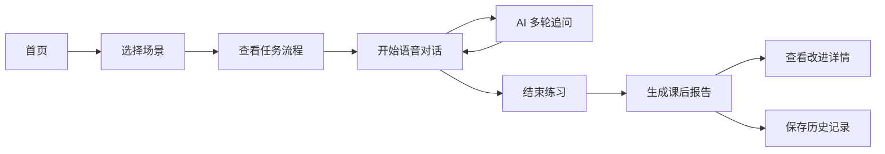
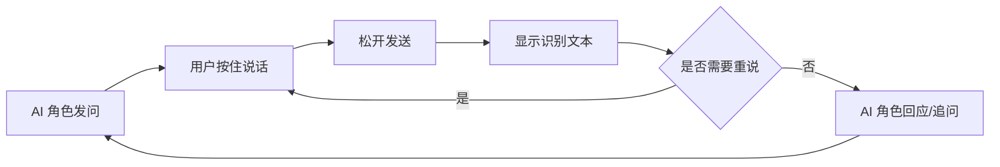

# AI 英语口语陪练 MVP 方案

研究日期：2026-06-06  
版本：V0.1  
说明：本 MVP 方案以题目图片中的要求为硬性范围，所有“必须功能”均纳入首版。

## 1. 核心重点

MVP 的核心不是做一个泛聊天机器人，而是做一个能完成“真实场景口语训练闭环”的工具。

用户进入产品后，应能在 5-10 分钟内完成一次完整练习：

1. 选择指定场景。
2. 进入该场景对应的固定角色扮演任务。
3. 与 AI 进行实时语音对话。
4. 在沉浸式角色扮演中完成按住说话式语音对话。
5. 结束后看到发音、语法、表达和流利度反馈。
6. 先看到总评分和水平描述，再按需进入改进详情。

最重要的产品体验指标：

- 敢开口：降低用户面对真人练口语的压力。
- 像实战：AI 不是问答机，而是在具体角色和固定场景任务里多轮互动。
- 不卡顿：语音端到端体验要流畅，延迟可感知但不能破坏对话。
- 纠得准：纠错要基于用户真实表达，避免把识别错误当成用户错误。
- 有进步感：每次练习后用户知道自己提升了什么、下次练什么。

### 1.1 角色扮演策略

本产品里的“场景练习”本质上是双人角色扮演：AI 扮演面试官、服务员或会议同事，用户也需要扮演应聘者、顾客或参会者。因为这不是真实面试或真实点餐，产品必须给用户一个清晰的角色身份和沟通目标，否则用户很容易不知道第一句话该怎么说。

MVP 面向初学者，但对话页不设计“让 AI 帮我”的工具按钮。AI 应该始终扮演好当前场景里的角色，用户也始终以场景中的身份回应。

推荐做法：

- 开始前只展示极简任务流程，让用户知道接下来会发生什么。
- 对话页只保留按住说话、AI 发言、识别文本、结束练习。
- 重复和澄清通过真实对话自然发生，例如用户说 “Sorry, could you repeat that?”，AI 以角色身份重复。
- 课后再给更完整的表达优化，而不是对话前一次性喂答案。

结论：首版重点是让用户沉浸在角色扮演里开口说话。对话页围绕真实对话展开，学习反馈集中在课后报告。

## 2. MVP 目标

### 产品目标

面向英语学习者提供一个场景化 AI 口语陪练工具，让用户可以随时进行面试、点餐、会议等真实场景训练，并获得可执行的口语反馈。

### 用户目标

- 我可以选择一个真实场景开始练习。
- 我可以直接开口说英语，不需要打字。
- AI 能自然接话、追问、澄清，而不是机械判题。
- 练完后我能先知道自己这次整体表现如何。
- 我想看细节时，可以进入详情页查看具体怎么改。

### 首版成功标准

- 用户能独立完成 1 次完整语音练习。
- 单次练习报告先展示总评分和水平描述，具体改进建议放到详情页。
- 至少覆盖 3 类高频场景，每个场景对应一个确定的角色扮演任务链。
- 对话结束后能保存记录，用户可回看 transcript 和报告。

## 3. 必须功能范围

以下功能来自题目要求，全部属于 P0，MVP 必须包含。

| 必须功能 | MVP 做法 | 验收标准 |
|---|---|---|
| 场景选择 | 提供面试、点餐、会议 3 个场景；用户选择场景后直接进入该场景固定任务 | 用户能从首页选择任一场景并开始练习，不需要二次选择任务 |
| 开练前准备 | 只展示场景名、一句话说明、预计时间、任务流程和开始按钮 | 用户能快速知道接下来要做什么，不被细节干扰 |
| 实时语音对话 | 支持用户语音输入，AI 语音回复，显示实时状态 | 能完成至少 6 轮连续语音对话 |
| 发音评测 | 对用户每轮发言做发音/可懂度评分，课后汇总 | 总览页可展示发音圆盘，详情页展示具体问题 |
| 语法/表达纠错 | 对用户表达给出语法、用词、自然表达建议 | 总览页不展开错误，详情页展示具体改法 |
| 课后总结 | 练习结束后生成结构化报告 | 报告先展示总评分、水平描述和一句话总结 |
| 对话自然度 | AI 基于角色、场景目标多轮追问 | AI 不只评价答案，能根据用户回答继续推进任务 |
| 语音端到端流畅性 | 语音识别、模型回复、语音合成串联 | 用户说完后首段 AI 回复 P95 不超过 4 秒 |
| 纠错精准度与时机 | 对话中不显性纠错，课后集中反馈 | 不打断角色扮演，报告中集中解释发音、语法和表达问题 |
| 口语能力量化反馈 | 建立总评分和细分评分 | 总评分优先展示，细分评分作为概览和详情入口 |

## 4. 目标用户

### 核心用户

英语初学者或有基础但开口少的学习者，典型水平 A1-B1。

### 典型场景

- 准备英文面试。
- 想练海外旅行和餐厅点餐。
- 工作中需要参加英文会议。
- 想提升日常英文表达自然度。

### 用户痛点

- 不敢跟真人说，怕尴尬。
- 背了很多词，但真实场景想不起来。
- 不知道自己发音和语法哪里错。
- 普通聊天 AI 能聊，但反馈不稳定、不成体系。
- 学完没有记录，不知道有没有进步。

## 5. 首版场景库

场景库用于产品内部配置。用户前台只看到“场景名称 + 一句话说明 + 任务流程”，不展示角色、难度、训练目标等细节。

### 场景一：英文面试

前台展示：

一句话说明：AI 会作为面试官向你提问，请用英语完成一段模拟面试。  
任务流程：

1. 30 秒自我介绍。
2. 介绍一个项目经历。
3. 回答面试官追问。
4. 向面试官反问一个问题。

内部配置：用户扮演应聘者，AI 扮演 HR / Hiring Manager。

### 场景二：餐厅点餐

前台展示：

一句话说明：AI 会作为餐厅服务员和你对话，请用英语完成点餐到结账。  
任务流程：

1. 预订座位。
2. 点餐并询问推荐。
3. 说明过敏或忌口。
4. 处理上错菜/等太久。
5. 结账和打包。

内部配置：用户扮演顾客，AI 扮演 Host / Waiter。

### 场景三：英文会议

前台展示：

一句话说明：AI 会作为同事或会议主持人与你沟通，请用英语完成一次简短会议。  
任务流程：

1. 同步本周进展。
2. 说明阻塞问题。
3. 澄清需求。
4. 表达不同意见。
5. 总结 action items。

内部配置：用户扮演参会者 / 项目成员，AI 扮演同事 / 客户 / 会议主持人。

## 6. 核心用户流程



## 7. 页面与功能设计

### 7.1 首页

首页采用“打开即练习”的极简设计，用户打开产品后焦点只在选择场景并开始练习。

页面只保留：

- 产品名称。
- 一句引导文案。
- 3 个场景入口：英文面试、餐厅点餐、英文会议。
- 左上角侧边栏入口。

| 设计 | 页面表现 | 作用 | 为什么这样设计 |
|---|---|---|---|
| 产品名称 | AI 英语口语陪练 | 让用户确认当前工具 | 标题足够即可，不做营销说明 |
| 引导文案 | 选择一个场景，马上开始练习 | 明确下一步动作 | 初学者不需要先看数据和历史，只需要知道怎么开始 |
| 场景入口 | 三个大按钮：英文面试、餐厅点餐、英文会议 | 让用户快速进入练习 | MVP 的核心动作是练习，首页不放报告、趋势、推荐等分散注意力的内容 |
| 侧边栏入口 | 左上角菜单图标 | 承载历史记录和长期数据入口 | 平时隐藏，不抢首页主视觉；需要回看时用户可以主动打开 |

侧边栏展开后展示：

| 模块 | 页面表现 | 作用 | 为什么这样设计 |
|---|---|---|---|
| 历史记录 | 最近练习列表：场景、日期、总评分 | 回看某次练习和报告 | 历史不是主任务，放在侧边栏里可用但不打扰练习 |
| 长期数据 | 练习次数、累计开口时长、总评分趋势 | 让用户看到长期进步 | 进步反馈重要，但不应压过“选择场景开始练” |

侧边栏信息层级：

```text
菜单

历史记录
- 英文面试 · 76 分 · 今天
- 餐厅点餐 · 82 分 · 昨天

长期数据
- 已练习 8 次
- 累计开口 42 分钟
- 平均总评分 74
```

### 7.2 开练确认页

用户选择场景后，不进入复杂详情页，只进入一个极简确认页。这个页面的目标不是教学，而是让用户有心理准备，知道接下来要做什么，然后立刻开始。

只保留：

- 场景名称。
- 一句话说明。
- 预计时间。
- 任务流程。
- 开始练习按钮。

页面结构建议：

| 设计 | 展示内容 | 作用 | 为什么这样设计 |
|---|---|---|---|
| 场景名称 | 英文面试 | 让用户确认自己选对场景 | 用户只需要知道“我要练什么”，不需要进入复杂详情 |
| 一句话说明 | AI 会作为面试官向你提问，请用英语回答 | 给用户心理准备 | 初学者需要知道接下来发生什么，否则进入语音页容易紧张 |
| 预计时间 | 约 5 分钟 | 降低开始成本 | 明确时间边界，用户更容易点开始 |
| 任务流程 | 自我介绍 → 项目经历 → 追问 → 反问 | 告诉用户接下来要做什么 | 只展示流程，不展示技巧，避免把练习前置成学习材料 |
| 开始按钮 | 开始练习 | 进入对话 | 页面目标是启动练习，不是承载教学 |

文案示例：

```text
英文面试

接下来 AI 会作为面试官向你提问，请用英语完成一段模拟面试。

预计 5 分钟

你将依次完成：
1. 自我介绍
2. 介绍项目经历
3. 回答面试官追问
4. 向面试官反问一个问题

[开始练习]
```

### 7.3 语音对话页

对话页的目标是让用户沉浸在场景里，而不是让用户操作 AI。MVP 面向初学者，所以页面必须极简、稳定、低压力。

设计原则：

- 只保留完成对话必需的信息和操作。
- 用户输入方式固定为“按住说话”。
- AI 始终以场景角色说话。
- 发音、语法、表达纠错主要放到课后报告，不在对话中频繁打断。

页面元素：

| 设计 | 页面表现 | 作用 | 为什么这样设计 |
|---|---|---|---|
| 场景状态 | 顶部显示“英文面试 · 第 2/4 步” | 告诉用户当前处在哪个场景、流程走到哪一步 | 初学者需要方向感，但不需要看到角色、难度、能力点等细节 |
| AI 当前发言 | 中间突出显示 AI 刚说的话，配合语音播放 | 让用户知道现在要回应什么 | 初学者听力不稳定，文字同步能降低听不清带来的挫败 |
| 对话历史 | 只保留最近 2-3 轮，可上滑查看完整记录 | 帮用户回忆上下文 | 全量聊天流会分散注意力，最近几轮足够支撑当前回答 |
| 主语音按钮 | 底部大按钮：“按住说话” | 让用户完成唯一核心动作 | 按住说话可避免自动收音误判，特别适合初学者停顿多、思考慢的情况 |
| 录音态反馈 | 按住时显示音量波形和“松开发送” | 让用户确认系统正在听 | 语音产品必须给即时反馈，否则用户不知道有没有录上 |
| 识别确认 | 松开后显示用户刚说的 transcript，支持“重说” | 防止识别错误直接进入评分 | ASR 错误不能当成用户口语错误，重说是输入修正，不是控制 AI |
| AI 状态 | 简短显示“AI 正在回应...” | 降低等待焦虑 | 语音对话有延迟，状态提示能让等待变得可理解 |
| 结束练习 | 右上角弱化按钮 | 用户可以主动结束并看报告 | 结束是流程控制，不能占据主视觉，否则会削弱沉浸感 |

推荐交互流程：



AI 对话行为规则：

| 规则 | 作用 | 为什么这样设计 |
|---|---|---|
| 一次只问一个问题 | 降低回答负担 | 初学者无法同时处理多个信息点 |
| 句子短、语速慢 | 提升可理解性 | 初学者最怕听不懂，默认慢速比临时调速更稳 |
| 用户说得很短时继续追问 | 拉长输出 | 口语提升来自真实产出，而不是一次性答对 |
| 用户要求重复时角色内重复 | 保持沉浸 | 现实场景里没听清本来就可以请对方再说一遍 |
| 语法讲解放到课后报告 | 避免打断 | 初学者先完成表达，练完再看问题更稳 |

### 7.4 对话中反馈

MVP 阶段对话中只处理“是否听懂”和“是否能继续聊下去”，评分和纠错集中在课后报告。

对话中反馈只保留：

- 识别文本确认：让用户知道系统听到了什么。
- 听不清时的重说：由用户点击“重说”，或 AI 角色自然请求确认。
- 场景内澄清：AI 以角色身份问更具体的问题。

这样设计的作用是保护沉浸感。初学者先完成一次可持续对话，课后再集中看发音、语法和表达问题。

### 7.5 课后报告页

报告页采用两级结构：先给总览，再让用户主动进入改进详情。MVP 面向初学者，报告第一页不堆错误、不堆细分解释，先帮助用户建立“我这次大概怎么样”的感知。

#### 报告总览页

总览页只保留：

- 总评分。
- 水平描述。
- 一句话总结。
- 细分评分圆盘。
- 查看改进建议按钮。
- 再练一次按钮。

| 设计 | 页面表现 | 作用 | 为什么这样设计 |
|---|---|---|---|
| 总评分 | 大号圆环分数，例如 76/100 | 让用户第一眼知道整体表现 | 初学者不需要先看一堆问题，先建立整体感受 |
| 水平描述 | “可以完成基本沟通” | 把分数翻译成人话 | 分数本身抽象，水平描述能降低理解成本 |
| 一句话总结 | “你能回答主要问题，但句子还偏短。” | 告诉用户最重要的结论 | 只给一个核心判断，避免信息过载 |
| 细分评分圆盘 | 展示 4 个小圆盘：发音、流利度、语法、表达 | 给用户一个大概方向，也让题目要求的评测能力可见 | 细分只做概览，不在总览页解释细节 |
| 查看改进建议 | 按钮进入详情页 | 承接“具体怎么改” | 想看细节的用户主动进入；详情页承载发音评测和语法/表达纠错 |
| 再练一次 | 按钮回到当前场景 | 促成下一次练习 | 口语提升依赖重复练，报告页要把用户带回练习 |

文案示例：

```text
本次得分
76

可以完成基本沟通
你能回答主要问题，但句子还偏短。

发音 78    流利度 70
语法 76    表达 72

[查看改进建议]
[再练一次]
```

细分评分圆盘说明：

- 总览页展示 4 个小圆盘，但不展开原因。
- 四个圆盘为发音、流利度、语法、表达。
- 细分评分的作用是让用户知道大概薄弱方向，同时让评委能看到系统确实覆盖发音评测和表达评估。

#### 改进详情页

改进详情页承接“具体怎么改”，用户从总览页点击进入。

详情页只展示 3 类内容：

| 模块 | 内容 | 作用 | 为什么这样设计 |
|---|---|---|---|
| 发音建议 | 1 条最明显的发音问题 | 证明系统具备发音评测能力 | 题目要求发音评测，但总览页不适合展开细节 |
| 语法/表达建议 | 1 条最重要的语法或表达问题 | 证明系统具备纠错能力 | 用户需要知道具体怎么改，但一次不展示太多 |
| 1 个复练入口 | “用推荐说法再说一遍” | 把反馈变成练习 | 学习闭环要从报告回到开口 |

详情页文案示例：

```text
发音建议
注意 project 的重音，重音在第一个音节：PRO-ject。

语法/表达建议
你刚才说：
I worked on a shopping app.

可以改成：
I worked on a shopping app, and I was responsible for the checkout flow.

[用这句话练一次]
```

## 8. 评分与反馈规则

### 8.1 总评分

总评分 = 发音 30% + 流利度 25% + 语法 25% + 表达自然度 20%。

总览页主展示总评分，同时展示四个细分评分圆盘。细分评分只提供大概方向，不在总览页展开解释。

### 8.2 发音评分

最低 MVP 指标：

- 单词发音准确度。
- 句子可懂度。
- 重音问题。
- 语速和停顿。

发音问题默认进入改进详情页。MVP 每次只展示 1 条最明显的发音建议。

### 8.3 语法/表达评分

最低 MVP 指标：

- 时态错误。
- 主谓一致。
- 介词和冠词。
- 中式表达。
- 不自然或不礼貌表达。

语法/表达问题默认进入改进详情页。MVP 每次只展示 1 条最重要的语法或表达建议。

### 8.4 流利度评分

最低 MVP 指标：

- 平均语速。
- 停顿次数。
- filler 词数量，例如 um、uh、you know。
- 单轮平均词数。

## 9. 语音体验指标

语音体验是本产品 MVP 的关键，必须单独验收。

| 指标 | MVP 目标 |
|---|---|
| 按住说话启动反馈 | 200ms 内出现录音态和波形 |
| 用户松开发送到识别文本出现 | P95 不超过 1.5 秒 |
| 用户松开发送到 AI 首段语音 | P95 不超过 4 秒 |
| AI 首字/首音频返回 | 支持流式输出 |
| 语音识别错误处理 | 显示识别文本，低置信时建议用户重说 |
| 输入方式 | 只做按住说话，松开发送 |
| AI 语音风格 | 默认初学者友好：短句、慢速、一次一个问题 |
| 网络异常 | 明确展示重试，不丢失当前练习 |

## 10. 数据记录

### 10.1 历史记录

历史记录指“每次练习完成后的可回看记录”，从首页左上角侧边栏进入。

| 数据 | 用途 |
|---|---|
| 场景名称 | 列表中展示用户练过什么 |
| 开始/结束时间 | 展示练习日期和时长 |
| 用户语音 transcript | 支持回看自己的表达 |
| AI 回复 transcript | 支持回看完整对话 |
| 每轮识别置信度 | 避免 ASR 低置信内容直接影响评分 |
| 总评分 | 历史列表展示本次大概表现 |
| 细分评分 | 报告总览页展示四个圆盘 |
| 水平描述 | 报告总览页展示人话结论 |
| 一句话总结 | 报告总览页展示核心反馈 |
| 改进详情建议 | 详情页展示发音建议和语法/表达建议 |

### 10.2 长期数据

长期数据指“跨多次练习形成的累计进步信息”，从首页左上角侧边栏进入。

| 数据 | 用途 |
|---|---|
| 累计练习次数 | 给用户练习量反馈 |
| 累计开口时长 | 体现口语练习投入 |
| 累计发言词数 | 衡量真实输出量 |
| 平均总评分 | 给用户总体水平感 |
| 总评分趋势 | 展示近期是否进步 |

## 11. 黑客松评审导向

本次黑客松评审规则决定了 MVP 不能只做“功能多”，而要证明产品闭环完整、交互有创新、工程质量稳定、demo 表达清楚。

| 评审项 | 占比 | MVP 应对策略 | 设计理由 |
|---|---:|---|---|
| 作品完整度与创新性 | 40% | 做完整闭环：选场景 → 开练确认 → 按住说话对话 → 课后报告 → 历史记录 | 评委更容易理解一个能跑通的产品，而不是一堆未串起来的功能 |
| 产品设计合理性 | 包含在 40% 内 | 面向初学者，前置信息极简，对话页沉浸，AI 不做工具按钮 | 与题目“真实对话训练”一致，减少用户下指令操控 AI 的工具感 |
| 功能完整度 | 包含在 40% 内 | 保证场景选择、语音对话、总览报告、改进详情全部可演示 | 图片要求的功能必须可见、可验收 |
| 交互流畅度 | 包含在 40% 内 | 只做按住说话，减少自动收音和复杂按钮带来的不稳定 | 初学者停顿多，按住说话更稳，也更适合现场 demo |
| 开发过程与质量 | 40% | 保持架构清晰：场景配置、语音链路、评分报告、历史记录分层 | 便于展示代码质量、模块边界和可维护性 |
| 演示与表达 | 20% | demo 只讲一条主线：用户选择“英文面试”，完成 3-4 轮对话，看总览报告，再点进改进详情 | 演示越短越清楚，越能让评委看到功能和效果 |

推荐 demo 顺序：

1. 选择一个场景，例如英文面试。
2. 展示极简开练确认页，说明用户接下来要做什么。
3. 进入语音对话页，用按住说话完成 3-4 轮角色扮演。
4. 展示 AI 如何保持角色并自然追问。
5. 结束练习，展示总评分和水平描述。
6. 点击查看改进建议，展示具体怎么改。

## 12. MVP 必做范围

以下内容为本次 MVP 必做，不在文档中展开后续版本能力。

- 场景选择。
- 首页侧边栏入口。
- 开练确认页。
- 按住说话语音输入。
- AI 语音回复。
- AI 当前发言字幕。
- 用户识别文本确认和重说。
- 场景内自然追问和澄清。
- 发音评分。
- 语法和表达纠错。
- 课后报告总览页。
- 改进详情页。
- 历史记录。
- 长期数据。
- 总评分和细分评分。

## 13. MVP 验收清单

上线前必须逐项验收：

- 用户能选择面试、点餐、会议任一场景。
- 用户能从首页左上角打开侧边栏。
- 用户选择场景后无需再选择任务，直接进入该场景固定任务。
- 用户能看到极简任务流程并开始练习。
- 用户能用语音完成至少 6 轮对话。
- AI 能围绕场景角色继续追问。
- 用户只能通过按住说话输入，不出现自动收音。
- 用户没听清时，可以通过自然语言让 AI 角色重复。
- 对话结束后能生成报告。
- 报告总览页有总评分、水平描述、一句话总结。
- 报告总览页用圆盘展示发音、流利度、语法、表达四个细分评分，但不展开具体问题。
- 用户点击后能进入改进详情页。
- 改进详情页展示 1 条发音建议和 1 条语法/表达建议。
- 历史记录可回看。
- 长期数据可在侧边栏中查看。
- 对话延迟不明显破坏体验。
- 按住说话录音稳定，松开后能快速识别。
- ASR 低置信时不会直接当作用户错误扣分。

## 14. 一句话产品方案

首版做一个“固定场景角色扮演型 AI 英语口语陪练”：用户选择面试、点餐或会议场景后，直接进入该场景对应的固定角色扮演任务；用户通过按住说话完成沉浸式语音对话，AI 始终扮演场景角色，并在课后先看到总评分和水平描述，再按需进入改进详情。
