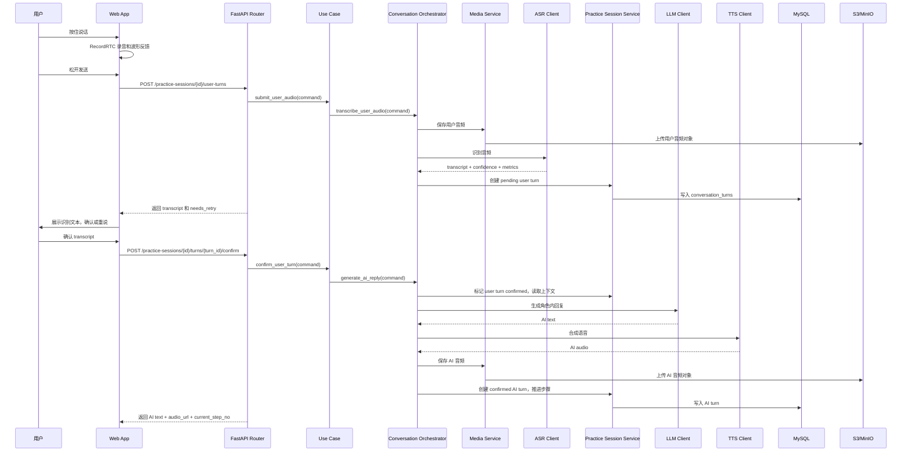
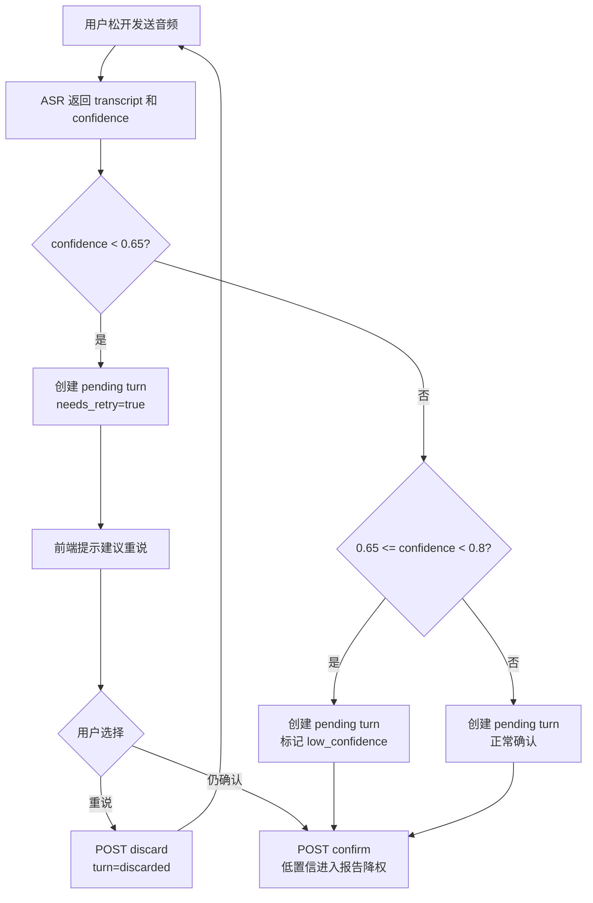
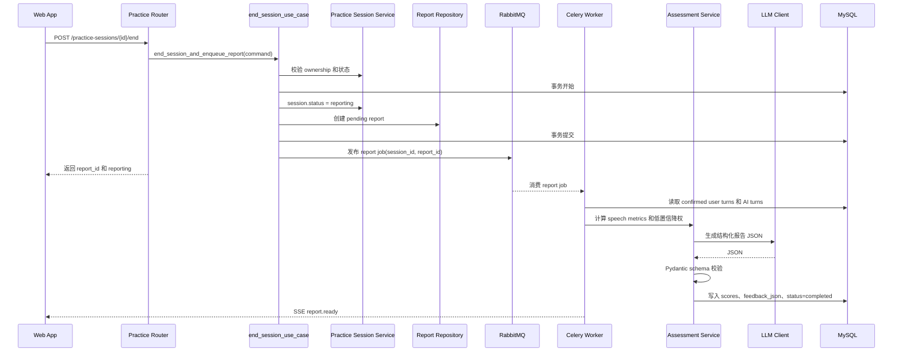
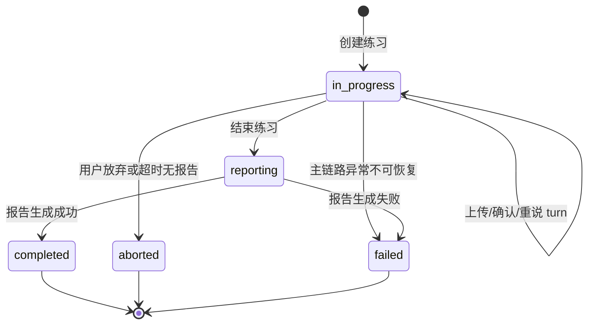
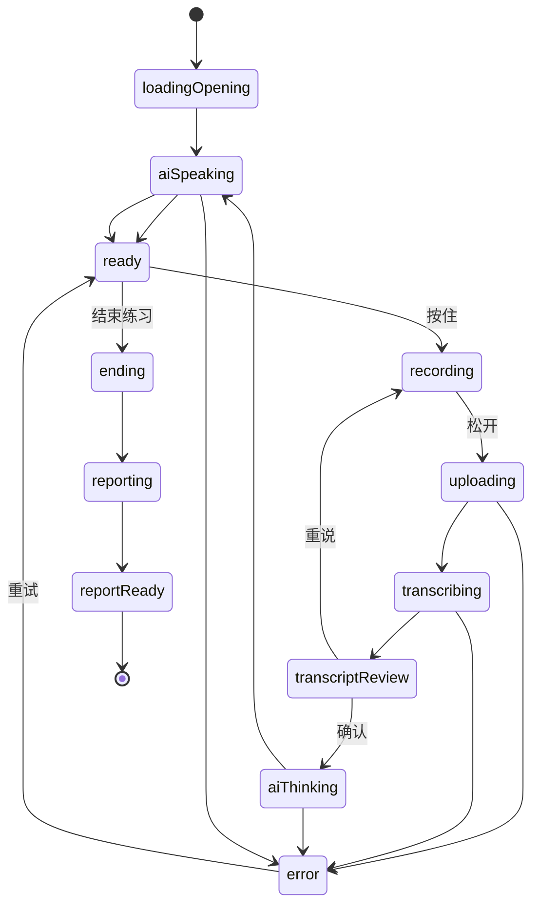

# 核心逻辑流程图

简单 CRUD 不单独画图。本文件只覆盖 MVP 中状态多、链路长、异常分支多的功能。

## 1. 单轮语音对话链路

关键规则：

- `/user-turns` 只完成 ASR 和 pending user turn 创建。
- `/confirm` 才进入 LLM / TTS。
- `client_turn_id` 保证上传幂等。
- 重复 confirm 返回已有 AI turn，不重复调用 provider。
- SSE 只推送进度，最终结果以 REST 响应或查询接口为准。

## 2. ASR 低置信与重说流程

关键规则：

- 低置信不是默认 HTTP 错误，前端仍能展示 transcript。
- `confidence < 0.65` 默认建议重说，不进入评分。
- 用户强行确认低置信内容时，报告生成要降权并标记低置信。

## 3. 结束练习与报告生成链路

失败处理：

| 失败点 | 处理 |
|---|---|
| 重复结束 session | 返回已有 report_id |
| 无 confirmed 用户 turn | 返回 `CONFLICT`，不创建报告 |
| LLM JSON 不合法 | 最多重试 2 次 |
| 重试后仍失败 | `assessment_reports.status=failed`，保留 transcript |
| SSE 断开 | 前端轮询 `GET /practice-sessions/{id}/report` |

## 4. 会话状态机

状态约束：

| 状态 | 允许操作 |
|---|---|
| `in_progress` | 上传用户语音、确认 turn、废弃 turn、结束练习 |
| `reporting` | 查询练习详情、查询报告、订阅 SSE；不允许继续提交 turn |
| `completed` | 查询历史、查询报告、再练一次 |
| `aborted` | 查询历史，报告可能不存在 |
| `failed` | 查询错误状态，可根据场景提供重试 |

## 5. 前端对话页状态机

